# MY FOOD

## Restaurant Management & POS System

### Installation, Device Pairing & Operations Manual

| | |
|---|---|
| **Restaurant** | Chefelisha Restaurant |
| **MY FOOD address** | **https://www.chefelisha.cc** (also works: https://bibiani-restaurant.vercel.app) |
| **Manual version** | 1.0 |
| **Date** | 29 September 2026 |
| **Software described** | MY FOOD web app release `production-2b3383f`; MY FOOD Printing 1.1.1; MY FOOD Hub 1.1.1 (Windows) |
| **Download** | In MY FOOD: **Set-up guide** or **Devices & printing** → **Manual and checklists** → **Download**. Direct link: https://www.chefelisha.cc/manual/MY-FOOD-Installation-and-Operations-Manual.pdf |
| **Intended readers** | Installation company and technician, restaurant owner and managers, supervisors, cashiers, waiters, kitchen staff, printing/IT support |

> **How to read this manual.** Sections 1–4 are for everyone. The **installer** follows sections 5–19 in order, then the checklists in sections 37–39. **Managers** use sections 6–7 and 20–31. **Cashiers, waiters and kitchen staff** only need their part of section 20 and the **Quick Reference Card** (section 40).
>
> Words in **bold** are the exact words you will see on the screen.
>
> **NOT CURRENTLY AVAILABLE** marks things MY FOOD does not do today. Do not promise them to the restaurant.

> **About the pictures.** The screenshots were taken from the MY FOOD **test** system, so some show "Chefelisha Restaurant (test)", test staff names and made-up printer addresses. The real system looks the same.

---

## Contents

1. What MY FOOD is made of
2. Which way this restaurant runs (online or with a Hub)
3. What needs internet, and what happens when it goes down
4. Words used in this manual
5. Pre-installation checklist (print this)
6. First-time setup: the owner
7. Staff, roles and PINs
8. Devices: the types and how to add them
9. **Pairing — the complete guide**
10. **Important pairing rules**
11. POS / till installation
12. MY FOOD Hub installation (optional)
13. MY FOOD Printing installation
14. Printer installation
15. Kitchen screen installation
16. Customer display installation
17. Supervisor screen
18. Device naming standard
19. Device installation table
20. Daily operations on the POS
21. Customers
22. Bills
23. Cashier register
24. Payments
25. Inventory and stock taking
26. Promotions and discounts
27. Reports
28. Exports (PDF, Excel, CSV)
29. Phones and tablets (mobile app)
30. Offline operation
31. End-of-day checklist
32. Start-of-day checklist
33. Troubleshooting
34. **If pairing goes wrong — do not keep generating codes**
35. Replacing a device
36. Security
37. Installer handover checklist
38. Installer device register
39. Contacts and escalation
40. Quick Reference Card
41. Screenshots: included and still required
42. What MY FOOD does NOT do today

---

## 1. What MY FOOD is made of

MY FOOD is a **website** that works like an app. Everything you use (the POS, the back office, the kitchen screens, the customer display, reports) is the same website. You open it in **Google Chrome** or **Microsoft Edge**, on a PC, tablet or phone.

There are two small Windows programs you may also install:

| Program | What it does | Needed? |
|---|---|---|
| **MY FOOD Printing** | Sends kitchen tickets, receipts and bills to the printers. A web browser cannot send to receipt printers by itself. | **Yes, if the restaurant prints**, and it is not using a MY FOOD Hub |
| **MY FOOD Hub** | Runs the restaurant on a PC inside the restaurant, so tills, kitchen screens, printers and the customer display keep working **without internet**. It also prints, so MY FOOD Printing is not needed with a Hub. | Optional |

### The pieces

```
                     INTERNET
                         │
                  MY FOOD CLOUD  (www.chefelisha.cc: the website, the data, the back office)
                         │
        ┌────────────────┴────────────────────────────────┐
        │                                                 │
  ONLINE MODE (today)                         HUB MODE (optional)
        │                                                 │
  Every device opens                           MY FOOD Hub PC in the restaurant
  www.chefelisha.cc                            (restaurant network, works offline)
        │                                                 │
  ├─ POS / tills                               ├─ POS / tills          (open the Hub's address)
  ├─ Kitchen screens                           ├─ Kitchen screens
  ├─ Customer display                          ├─ Customer display
  ├─ Supervisor screen                         ├─ Supervisor screen
  ├─ Phones / laptops of owner & managers      └─ Printers (the Hub prints)
  └─ MY FOOD Printing PC ── Printers
```

---

## 2. Which way this restaurant runs

MY FOOD runs a restaurant branch in **one of two ways**. Decide this with the owner **before** installing.

| | **Online mode** | **Hub mode** |
|---|---|---|
| Where devices connect | Straight to **www.chefelisha.cc** over the internet | To the **MY FOOD Hub PC** on the restaurant network |
| Internet needed to take orders | **Yes** | **No** (the Hub keeps working; data is sent to the cloud when internet returns) |
| Printing done by | **MY FOOD Printing** on one PC | The **Hub** itself |
| Extra PC needed | A PC for MY FOOD Printing (can be a till PC) | An always-on Hub PC |
| Status today at Chefelisha | **In use** | Not switched on |

> **Important.** MY FOOD Hub has been fully tested in software, but **has not yet been run on a real Windows PC in the restaurant**. If you install it, test it fully (section 12) before relying on it for service.

---

## 3. What needs internet, and what happens when it goes down

### Online mode

| Situation | What happens |
|---|---|
| **Internet goes down** | New orders cannot be sent. The till shows **No connection to the server. Your action will be retried.** and a **Retry send** button. Nothing is lost or duplicated. Press **Retry send** when the internet is back. Kitchen screens show **Kitchen connection lost. Reconnecting…** |
| **Internet comes back** | Screens reconnect by themselves. Press **Retry send** on any order that was waiting. |
| **A paired device restarts** | It stays paired. Tills open on the staff PIN pad; kitchen screens and the customer display open straight to their screen. |
| **The MY FOOD Printing PC is off** | Nothing prints. Print jobs **wait** and print as soon as MY FOOD Printing runs again. Kitchen screens still show every order. |

### Hub mode

| Situation | What happens |
|---|---|
| **Internet goes down, Hub stays on** | Everything in the restaurant keeps working: orders, kitchen screens, printing, payments, the customer display. Tills show **Offline · everything keeps working and is saved on the hub · N changes to send**. |
| **Internet comes back** | The Hub sends everything to the cloud by itself. Each record is sent once; sending twice never creates duplicates. |
| **The Hub PC goes down** | Tills, kitchen screens, printers and the display stop working. If the **internet** still works, a manager can switch the branch back to online mode: Devices & printing → Hub row → **Stop running branch**. Staff then open **www.chefelisha.cc** on the tills. |
| **Staff sign-in without internet** | Works only for staff who have signed in on that Hub at least once while it was online. |

### Which devices must be on the same network

- **Hub mode:** every till, kitchen screen, customer display and printer must be on the **same restaurant network** as the Hub PC.
- **Online mode:** the **printers** must be on the same network as the **MY FOOD Printing PC** (or plugged into it by USB). Other devices only need internet.

---

## 4. Words used in this manual

| Word | Meaning |
|---|---|
| **Back office** | The management pages of MY FOOD (Dashboard, Menu, Staff, Devices & printing, Reports…). |
| **Till / POS** | A PC, tablet or phone where staff take orders and payments. |
| **Kitchen screen** | A screen in the kitchen that shows the orders for one **station** (e.g. Main Kitchen, Grill, Drinks). |
| **Station** | A place where food or drink is prepared. Each product goes to a station. |
| **Customer display** | A screen facing customers showing order numbers being prepared and ready. |
| **Customer screen** | The second monitor of a dual-screen till, facing the customer at the counter (section 11.4). |
| **Print agent** | The device record in MY FOOD for the PC that runs **MY FOOD Printing** (e.g. **PRINT-AGENT-01**). |
| **Pairing** | Connecting a device to the restaurant's MY FOOD, once, using a short code. |
| **PIN** | A staff member's personal 4–6 digit code for signing in. |
| **Business day** | The trading day. Orders before the **Business day ends at** time (04:00 by default) count for the previous day. |

---

## 5. Pre-installation checklist (print this)

### Internet and network

- ☐ Internet connection is working in the restaurant
- ☐ Wi-Fi name: ______________________ (write the password on a separate sheet, **not** in this manual)
- ☐ Ethernet cables available where needed (printers, Hub PC, printing PC)
- ☐ Tested: a PC in the restaurant can open **https://www.chefelisha.cc**
- ☐ Router admin access available (to find printer addresses, if needed)

### Computers and screens (one line each)

| Device purpose | Name to use | Location | Windows version | Chrome or Edge installed | Opens www.chefelisha.cc | Network OK |
|---|---|---|---|---|---|---|
| POS / till | POS-01 | | | ☐ | ☐ | ☐ |
| POS / till | POS-02 | | | ☐ | ☐ | ☐ |
| Kitchen screen | KITCHEN-01 | | | ☐ | ☐ | ☐ |
| Kitchen screen | DRINKS-01 | | | ☐ | ☐ | ☐ |
| Customer display | CUSTOMER-DISPLAY-01 | | | ☐ | ☐ | ☐ |
| Printing PC (MY FOOD Printing) | PRINT-AGENT-01 | | Windows 10/11 | ☐ | ☐ | ☐ |
| Hub PC (only for Hub mode) | HUB-01 | | Windows 10/11 | ☐ | ☐ | ☐ |

### Printers (one line each)

| Printer name | Location | Station / use | Network or USB | IP address (network) | Paper width 58/80 mm | Paper loaded | Powered on | Printer self-test page printed |
|---|---|---|---|---|---|---|---|---|
| KITCHEN-PRINTER-01 | | Kitchen tickets | | | | ☐ | ☐ | ☐ |
| RECEIPT-PRINTER-01 | | Receipts and bills | | | | ☐ | ☐ | ☐ |

> **Tip.** Most receipt printers print a **self-test page** when you hold the **FEED** button while switching them on. That page usually shows the printer's **IP address**.

> **Supported printers.** Receipt (thermal) printers that understand **ESC/POS** — almost all of them — connected by **network cable / Wi-Fi** (IP address, port 9100) or by **USB** into the PC that runs MY FOOD Printing (or the Hub). USB needs the printer's Windows driver installed.

### People

- ☐ Owner's email address (for the owner account)
- ☐ List of staff: full name, role, email (email only for owners/managers or staff who want PIN recovery by email)
- ☐ Menu: categories, products, prices, options, and which station prepares each product
- ☐ Tax rates to apply (ask the restaurant's accountant)
- ☐ Tables and service areas (e.g. Hall, Terrace, Takeaway)

---

## 6. First-time setup: the owner

### 6.1 How the owner account is created

The owner account is created by **invitation**, so nobody can take over the restaurant.

1. **MY FOOD support** creates an invitation for the owner's email address.
2. The owner opens **https://www.chefelisha.cc/welcome** on the phone or computer they will use most. The screen says **Welcome to MY FOOD**.
3. The owner types their email in **Owner email** and presses **Send verification link**.
4. The owner opens the link from the email **on the same device**.
   - The link is valid for 1 hour and works once.
   - If it has expired, the screen says **Link expired**: go back to step 2.
5. On **Set up your restaurant**, the owner types **Your full name**, **Choose your PIN** and **Repeat the PIN**, then presses **Create owner account**.
6. MY FOOD opens the **Set-up guide** (section 6.4).

> **Email sending (read this).** Today, MY FOOD's emails are sent by a basic service that does not reliably reach restaurant email addresses. Until a proper email service is connected, **MY FOOD support gives the owner the verification link directly** (in person or by a private message) instead of step 3. Whoever opens that link can create the owner account, so **never forward it**.

### 6.2 PIN rules

- 4 to 6 digits.
- Each person's PIN must be different. If a PIN is taken, MY FOOD says **This PIN is already in use. Please choose another PIN.** without saying whose it is.
- Simple PINs such as 1234 or 1111 are refused.
- 5 wrong PINs on one device (or 30 across the restaurant) within 10 minutes lock PIN sign-in for 10 minutes.
- PINs are never shown, printed, sent or stored in readable form.

### 6.3 Signing in later

| Where | How |
|---|---|
| **The device the owner set up on** | Open www.chefelisha.cc → the PIN pad appears (**Enter your staff PIN**) → type the PIN → **Sign in**. |
| **A new phone or laptop** | Open www.chefelisha.cc → **Sign in** screen → type **Email** and **PIN** → **Sign in**. That device is then remembered: next time only the PIN is asked (*Next time on this device, just enter your PIN.*). Only owners and managers can do this. |
| **A restaurant till** | Type the PIN on the till's PIN pad. |

> **Owner on a shared till.** On a restaurant till, a PIN runs the POS but **cannot** manage staff, devices or settings. Use your own phone or laptop for that.

**Forgotten PIN (owner or manager).** On the sign-in screen press **Forgot PIN?**, type your email, press **Email me a link**, open the link and choose a new PIN. (This needs email sending, see 6.1.) Another owner can also reset it in **Staff**.

**Wrong PINs.** After 5 wrong PINs with an email, sign-in for that email is locked for 10 minutes. After 10 in a day, it is locked for the day.

### 6.4 Set-up guide

The **Set-up guide** (Management → **Set-up guide**) lists everything to prepare, with a button for each step. Any step can be done later.

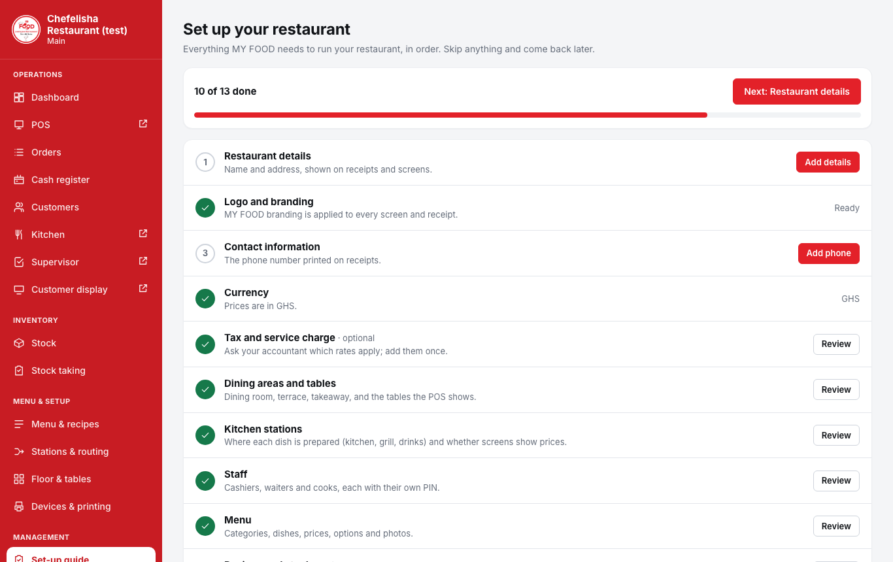

Steps shown:
1. **Restaurant details** (**Add details**)
2. **Contact information** (**Add phone**)
3. **Receipt settings** (**Add message**)
4. **Dining areas and tables** (**Set up floor**)
5. **Kitchen stations** (**Set up stations**)
6. **Tax and service charge** (**Add taxes**)
7. **Menu** (**Add menu**)
8. **Recipes and stock** (**Add stock items**)
9. **Staff** (**Add staff**)
10. **POS devices** (**Pair a till**)
11. **Customer display** (**Connect display**)

It also shows **Logo and branding** and **Currency**, which are already set.

Recommended order for the installer: **Settings → Floor & tables → Menu & recipes (taxes first) → Stations & routing → Staff → Devices & printing.**

### 6.5 Settings

Management → **Settings**:
- **Restaurant name**, **Phone** and **Receipt message** (the last line of every receipt);
- **Branch name**, **Address**, **Business day ends at** and **Time zone**.

Press **Save settings**.

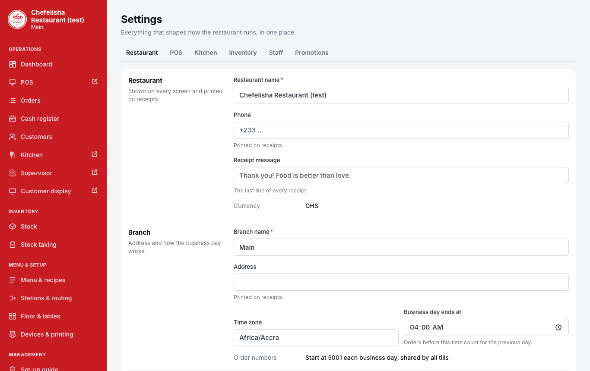

### 6.6 Floor & tables

Menu & setup → **Floor & tables**:

1. **Operational areas and payment policy**: add each area (e.g. *Hall*, *Takeaway*) with a **Channel**: dine in or takeaway.
   - **Payment policy**: *pay after fulfillment* (normal for tables) or *pay before fulfillment*.
   - **Pay before cooking**: tick it for areas where customers must pay before the kitchen starts (e.g. takeaway counters). The till then shows **Save order, then take payment**.
2. **Tables**: add each table with a **Label** (e.g. 1, 2, T1), the number of **Seats** and the **Area**.

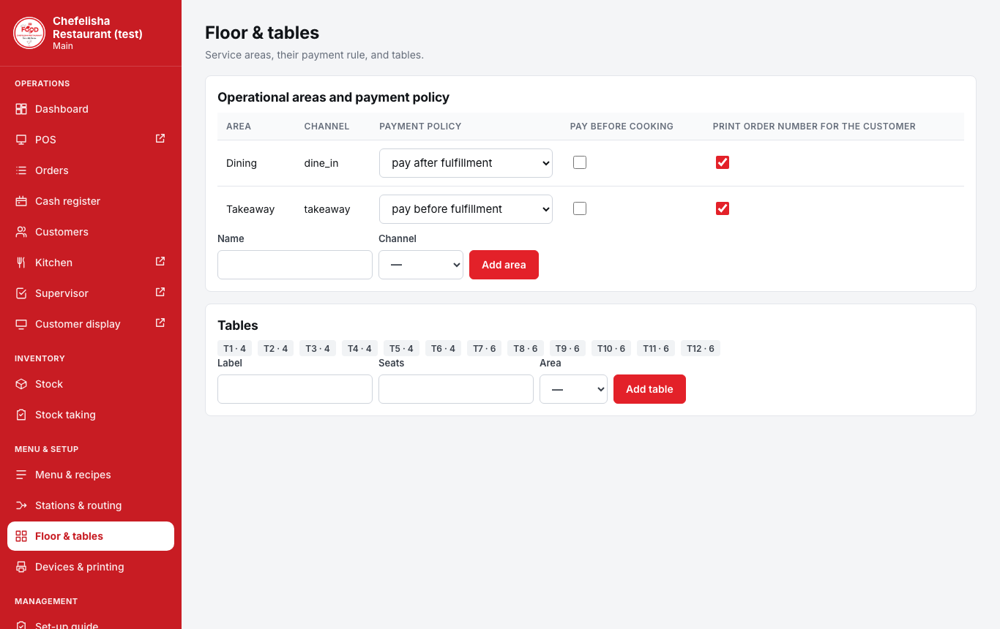

### 6.7 Menu & recipes

Menu & setup → **Menu & recipes**:

1. **Taxes**: add each tax rate the accountant gives you. **Included in prices** means the tax is inside the menu price; **Added on top** means it is charged on top. MY FOOD never assumes a tax rate.
2. **Categories**: e.g. Food › Rice Dishes, Drinks.
3. **Products**: **Add product**. Fill in:
   - **Name**; **Name on kitchen tickets** (optional, short, e.g. JOLLOF);
   - **Description**, **Category** and price;
   - **Tax**, the kitchen station, and a **Photo** (optional);
   - **Extras and options** (modifier groups);
   - **Recipe** (ingredients per portion, so each sale deducts stock).

   Then press **Save product**.
4. **Modifiers**: **New modifier group** (e.g. *Pepper*: No pepper, Extra pepper +GHS 2).
5. **Mark sold out** / **Back on sale**: sold-out products cannot be added at the till.

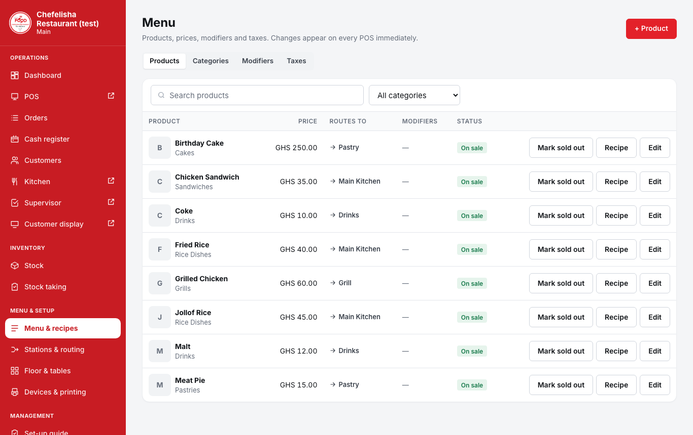

---

## 7. Staff, roles and PINs

### 7.1 The roles

MY FOOD has these roles (the same for every restaurant):

| Role | Meant for |
|---|---|
| **Owner** | Everything, including staff and roles |
| **Manager** | Everything, including adding staff (but cannot give the Owner role or change an Owner) |
| **Supervisor** | Watching the floor and kitchen, taking orders, serving, discounts, reports, customer list |
| **Cashier** | Taking orders and payments, own cash register |
| **Waiter** | Taking and sending orders, serving |
| **Kitchen** | Kitchen screen |
| **Inventory Manager** | Stock, stock taking, reports |

### 7.2 What each role can do

(From the system's role definitions; also shown in **Staff → Roles & permissions**. Every role can take orders and send them to the kitchen.)

| Permission (as shown in MY FOOD) | Owner | Manager | Supervisor | Cashier | Waiter | Kitchen | Inventory Manager |
|---|---|---|---|---|---|---|---|
| Take orders | ✓ | ✓ | ✓ | ✓ | ✓ | ✓ | ✓ |
| Send to kitchen | ✓ | ✓ | ✓ | ✓ | ✓ | ✓ | ✓ |
| See orders | ✓ | ✓ | ✓ | ✓ | ✓ | ✓ | ✓ |
| Serve / hand over | ✓ | ✓ | ✓ | ✓ | ✓ | | |
| Cancel orders | ✓ | ✓ | | | | | |
| Void items | ✓ | ✓ | | | | | |
| Take payments | ✓ | ✓ | | ✓ | | | |
| Void payments | ✓ | ✓ | | | | | |
| Refund | ✓ | ✓ | | | | | |
| Print receipts | ✓ | ✓ | ✓ | ✓ | ✓ | | |
| Manager discounts | ✓ | ✓ | ✓ | | | | |
| Own cash register | ✓ | ✓ | | ✓ | | | |
| All registers & reopen | ✓ | ✓ | | | | | |
| Add customers to orders | ✓ | ✓ | ✓ | ✓ | ✓ | ✓ | ✓ |
| Customers list & history | ✓ | ✓ | ✓ | | | | |
| Edit & merge customers | ✓ | ✓ | | | | | |
| Kitchen screen | ✓ | ✓ | ✓ | | | ✓ | |
| Dashboard & reports | ✓ | ✓ | ✓ | | | | ✓ |
| Manage stock | ✓ | ✓ | | | | | ✓ |
| Count stock | ✓ | ✓ | | | | | ✓ |
| Menu & routing | ✓ | ✓ | | | | | |
| Promotions | ✓ | ✓ | | | | | |
| Floor & settings | ✓ | ✓ | | | | | |
| Devices | ✓ | ✓ | | | | | |
| Print queue | ✓ | ✓ | | | | | |
| Staff & roles | ✓ | ✓ | | | | | |
| Audit history | ✓ | ✓ | | | | | |

> **Changing what a role can do** (custom roles or custom permissions) is **NOT CURRENTLY AVAILABLE** in the screens. The **Roles & permissions** tab is for viewing.

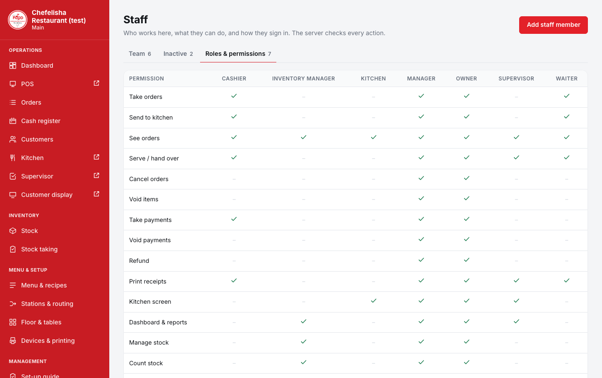

### 7.3 Adding a staff member

1. On **your own phone or laptop** (Owner or Manager; not a shared till), Management → **Staff** → **Add staff member**.
2. Fill in **Full name** (shown on orders, receipts and reports), **Email**, **Role** and **Access** (this branch or all branches).
3. Either set a **Starting PIN** (4–6 digits), or a **Password (optional)** of at least 10 characters. Staff who only use the tills do not need a password.
4. Press **Save changes**.
5. Give the starting PIN to the person **privately**. At their first sign-in on a till, MY FOOD asks them to choose their own PIN (**Choose your own PIN (4–6 digits). Only you will know it.**). Until then the Staff list shows **Awaiting first sign-in**.

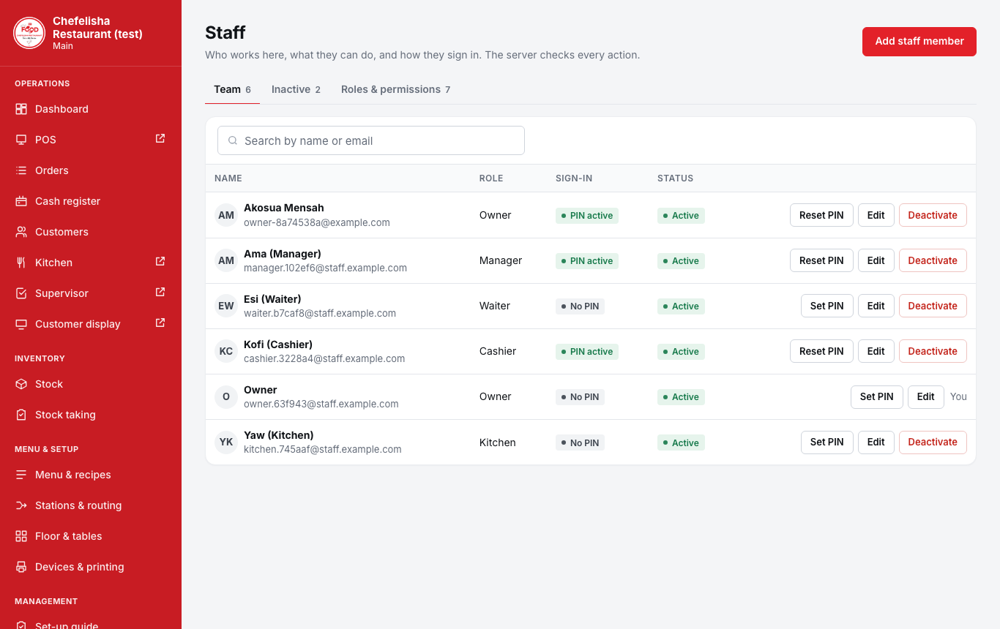

### 7.4 Changing, resetting and removing

| Task | How |
|---|---|
| Change name, role or access | Staff → open the person → change → **Save changes** |
| Forgotten PIN (staff) | Staff → the person → **Reset PIN** (or **Assign PIN** / **Set PIN**): give them a new starting PIN; they choose their own at next sign-in |
| Someone leaves | Staff → the person → **Deactivate**. They can no longer sign in anywhere, including on the Hub after its next sync. Their past orders and payments stay, under their name. |
| Someone returns | **Inactive** tab → **Reactivate** |
| Delete a staff member completely | **NOT CURRENTLY AVAILABLE** (deactivate instead; history must be kept) |

### 7.5 How staff sign in

- **On a restaurant till:** the PIN pad (**Enter your staff PIN**) → type the PIN → **Sign in**. When finished, press **Lock** (top of the POS).
- **Forgotten PIN on a till:** **Forgot PIN?** sends a link to the staff member's email, if they have one; otherwise a manager resets it in Staff.
- **What staff see:** only the menu items for what their role allows (section 7.2). The server checks every action, so hiding a button is never the only protection.

---

## 8. Devices: the types and how to add them

### 8.1 Device types

These are all the device types in MY FOOD (Devices & printing → **Add device** → **Type**):

| Type (as shown) | What it is | Pairs? |
|---|---|---|
| **POS till** | A till for orders and payments. Staff sign in on it with their PIN. | Yes |
| **Kitchen screen** | Shows one station's tickets (START / READY). | Yes |
| **Customer display** | The public "Preparing / Ready" board. | Yes |
| **Print agent** | The record for the PC running **MY FOOD Printing**. | Yes (from MY FOOD Printing) |
| **Printer** | A receipt/ticket printer. | **No**: printers are driven by the print agent (or Hub) |
| **MY FOOD Hub** | The Hub PC. | Yes (from the Hub window) |

> The **Supervisor** screen is not a device type. Anyone allowed can open it on a signed-in device (section 17).

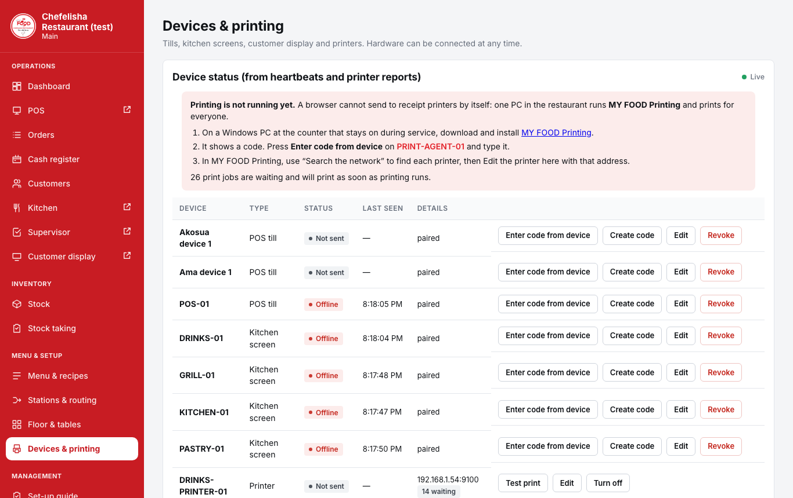

### 8.2 Adding a device record

Before a device can be paired, it needs a record in MY FOOD.

1. On your own phone or laptop, sign in as owner/manager → Menu & setup → **Devices & printing**.
2. Scroll to **Add device**.
3. **Name**: follow section 18 (e.g. `POS-02`). Letters, numbers, spaces and dashes only.
4. **Type**: choose from the table above.
5. Extra fields:
   - **Station (KDS)**, for a kitchen screen: which station it shows.
   - **Receipt printer (POS)**, for a till: where its receipts and bills print.
   - **Printer connected by**, printer address and **Printer driven by agent**, for a printer (section 14).
6. Press **Add device**.

### 8.3 Editing a device

On the device's row press **Edit**:
- **Printers:** name, **How is it connected?**, **Printer IP address** (or **Windows printer name**), **Paper width**, **Printed by**, **Backup printer (optional)**.
- **Tills:** **Receipt printer**.
- **Kitchen screens:** **Station**.

Other devices have **Rename**.

### 8.4 The status of a device

The **Device status** table shows each device's **Status** (Online, Offline, Not connected), **Last seen**, and details (**paired** / **not paired**, printer address, jobs **waiting**).

The coloured panel at the top says plainly whether printing is working and what to fix (e.g. *Printing is not running yet*, *Printing has stopped*, *Printing is on*).

### 8.5 Revoking a device

Press **Revoke** on its row and confirm. The device stops working **immediately** and returns to the pairing screen. Use this for a lost, stolen or replaced device.

---

## 9. Pairing — the complete guide

**Pairing** connects one physical device to one device record in MY FOOD, **once**. After pairing, the device stays connected through refreshes and restarts. It never needs pairing again unless it is revoked or replaced.

There are **two kinds of code**, used in **opposite directions**:

| | **A. Code SHOWN ON the device** | **B. Code CREATED in MY FOOD** |
|---|---|---|
| Made by | The device itself (on **Pair this device**, in MY FOOD Printing, or in the Hub window) | A manager pressing **Create code** on the device's row |
| Typed into | **Devices & printing → that device's row → Enter code from device** | **The device itself:** Pair this device → **I have a code from a manager** |
| Looks like | `K7M4-Q2RT` (8 characters) | `K7M4Q2RT` (8 characters) |
| Valid for | 10 minutes, once | 10 minutes, once |

> ### ⚠ PAIRING CODE WARNING
>
> - A code **shown by a device** is entered **on that same device's row**, with **Enter code from device**.
> - A code **made with Create code** is typed **on the device**, never in "Enter code from device".
> - Never enter one device's code on another device's row.
> - A **MY FOOD Printing** code goes **only** on the **print agent** row (e.g. **PRINT-AGENT-01**), never on a till.
> - A **MY FOOD Hub** code goes **only** on the **MY FOOD Hub** row, never on a till.
> - Do not keep making new codes while troubleshooting. If a code is still on the screen, it still works.

### 9.1 Method A — the device shows a code (recommended)

**On the device** (till, kitchen screen or customer display):
1. Open Chrome or Edge.
2. Go to **https://www.chefelisha.cc/pair** (Hub mode: the Hub's address + `/pair`, see section 12).
3. The screen shows **Pair this device** and a code like **K7M4-Q2RT**, with *Waiting for approval · the code works for 10 minutes*.

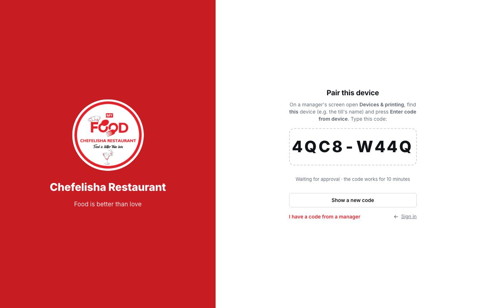

**On your own phone or laptop** (signed in as owner/manager):
1. Menu & setup → **Devices & printing**.
2. Find the row with **this device's name** (e.g. POS-02).
3. Press **Enter code from device** on **that row**.
4. Type the code exactly as shown. Dashes, spaces and lower case do not matter.
5. Press **Pair device**.

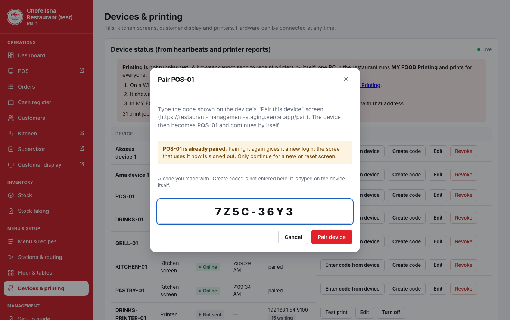

**The device continues by itself within a few seconds:**
- a **till** shows the staff PIN pad (**Enter your staff PIN**);
- a **kitchen screen** shows its station;
- the **customer display** shows the board.

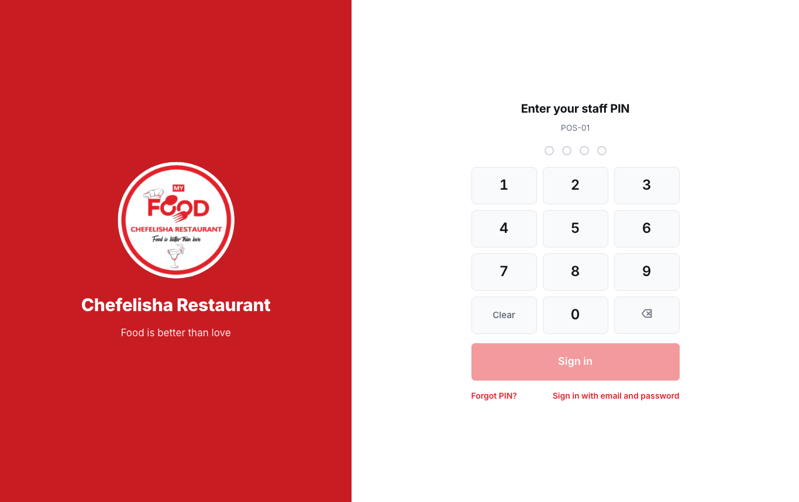

If the device row already says **paired**, the dialog warns: *POS-02 is already paired. Pairing it again gives it a new login: the screen that uses it now is signed out.* Only continue if you are replacing that screen.

### 9.2 Method B — the manager creates a code

**On your own phone or laptop:**
1. Devices & printing → the device's row → **Create code**.
2. A code appears. It works once and expires after 10 minutes.

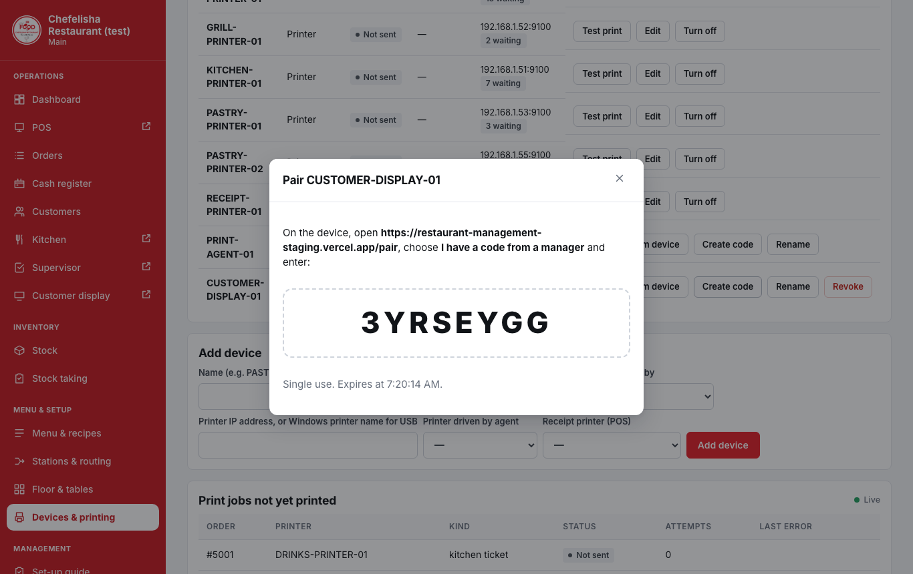

**On the device:**
1. Open **https://www.chefelisha.cc/pair**.
2. Press **I have a code from a manager**.
3. Type the code in **Pairing code** and press **Pair device**.

### 9.3 MY FOOD Printing (print agent)

1. Start **MY FOOD Printing** on the printing PC. It shows a code under **Connect this PC to MY FOOD**.
2. In Devices & printing, press **Enter code from device** on the **print agent** row (e.g. **PRINT-AGENT-01**), **not** on the PC's till row.
3. Type the code and press **Pair device**.
4. MY FOOD Printing shows **Printing is on · PRINT-AGENT-01**.

If the code is entered on a till's row by mistake, MY FOOD refuses it and **nothing changes**. The message reads *This code comes from MY FOOD Printing, which can only be paired as a print agent…*, the till keeps working, and the same code stays on the printing PC.

### 9.4 MY FOOD Hub

1. Add a device of type **MY FOOD Hub** (e.g. HUB-01) in Devices & printing.
2. Start MY FOOD Hub on the Hub PC. The Hub window shows **Connect this hub to MY FOOD** and a code.
3. Press **Enter code from device** on the **MY FOOD Hub** row, type the code, and press **Pair device**.

In Hub mode, tills and screens then pair **with the Hub**, in the Hub window (section 12.5).

### 9.5 Owner's or manager's own phone or laptop

These do not use pairing codes. Sign in with **Email** and **PIN** (section 6.3). MY FOOD registers the device as that person's own device (e.g. *Chef device 1*). It appears in Devices & printing and can be revoked there.

### 9.6 After pairing

- Refreshing, closing or restarting a paired device does **not** create a new code.
- Opening `/pair` on a paired till shows **This device is already paired** with **Go to sign-in** and **Pair this device again**. Only press the second if you really want to re-pair it.

---

## 10. Important pairing rules

> ### IMPORTANT PAIRING RULES
>
> 1. **One code, one pairing.** A code pairs one device, once. It cannot pair another device afterwards.
> 2. **Right row.** A code shown on a device goes on **that device's** row (**Enter code from device**).
> 3. **Right direction.** A **Create code** code is typed **on the device** (**I have a code from a manager**), never in **Enter code from device**.
> 4. **Printing codes only on the print agent row. Hub codes only on the Hub row.** MY FOOD refuses them anywhere else.
> 5. **Use the code that is on the screen now.** It stays the same while it waits: through no-internet moments and until it expires after 10 minutes.
> 6. **Only ask for a new code when needed.** Press **Show a new code** only if the code has expired or you really need a new one. The old code then stops working.
> 7. **Do not keep pressing Create code.** Each new code replaces nothing on the device; it only adds confusion.
> 8. **Already paired means done.** If a device says **This device is already paired**, do not pair it again unless you are deliberately replacing or re-pairing it.
> 9. **Pairing an already-paired device signs its current screen out.** MY FOOD warns you before you do it.
> 10. **Never pair a device you do not recognise.**

---

## 11. POS / till installation

### 11.1 Prepare the till

1. Turn on the PC or tablet.
2. Connect it to the restaurant Wi-Fi or network cable.
3. Open **Google Chrome** or **Microsoft Edge**.
4. Go to **https://www.chefelisha.cc/pair**.
5. Pair it with Method A (section 9.1) on its row (e.g. **POS-02**). Add the device record first if needed (section 8.2).
6. The till shows **Enter your staff PIN** and its name (e.g. *This till: POS-02*).
7. *(Optional)* Install it as an app: Chrome shows an install icon in the address bar (or menu → **Install MY FOOD**). It then opens full screen from the desktop.
8. In Devices & printing, **Edit** the till → **Receipt printer** → choose its printer → **Save**.

### 11.2 Test the till

1. Sign in with a staff PIN (a cashier's is best).
2. The POS shows the service areas as tabs (e.g. **Hall**, **Takeaway**), plus **Bills** and **Completed**.

   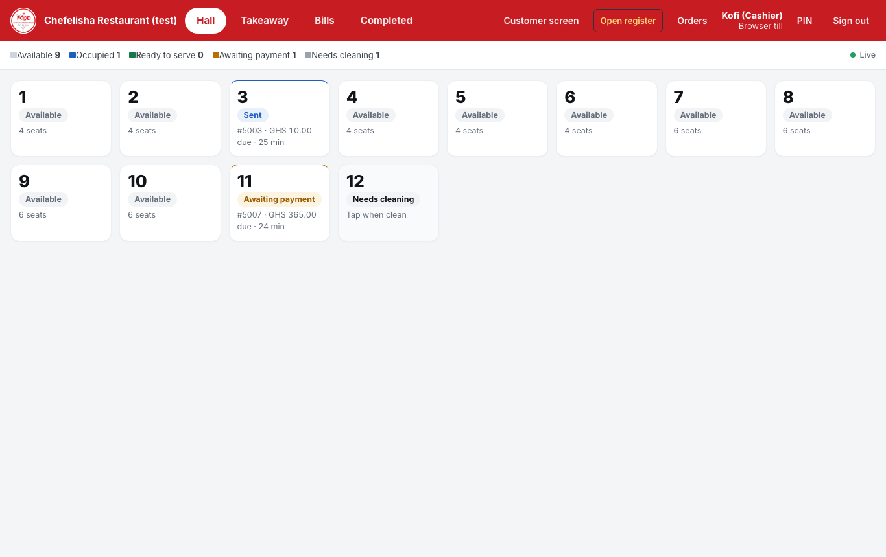

3. **Takeaway** tab → **+ New takeaway order**.
4. Tap a product; tap one with options to test **modifiers** (a window asks for the options).
5. Type a name in **Customer name** (and optionally a phone number).
6. Press **Send to kitchen**. The order header shows **Takeaway #number**.

   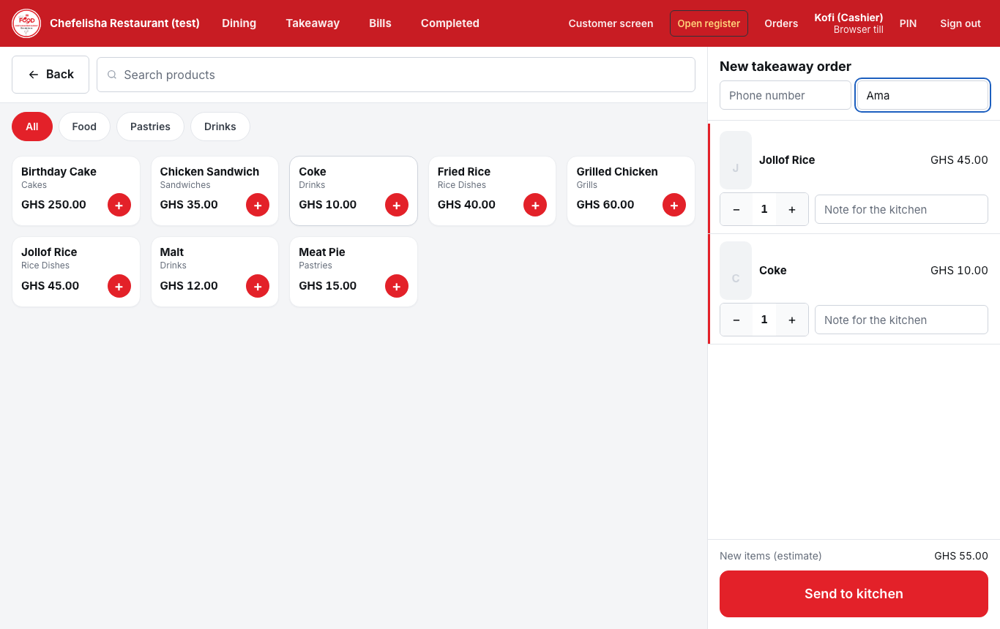

7. Check the **kitchen screen** shows the ticket (with *Sent by …*), and the **kitchen printer** printed it (if used).
8. Press **Take payment** → **CASH** → type **Cash received** (e.g. 100) → the **Change** is shown → **Complete payment**.

   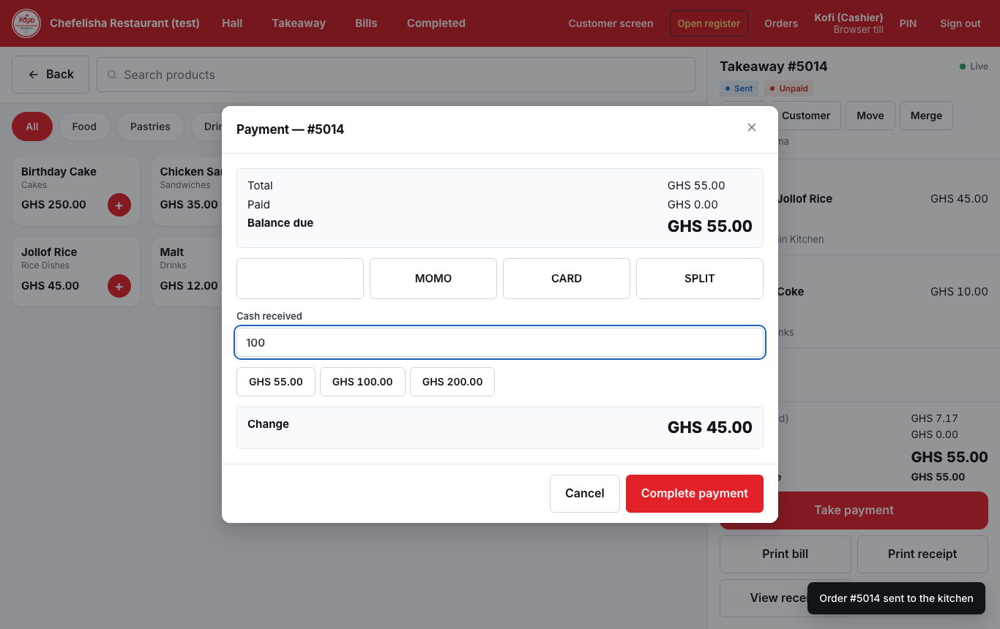

9. Press **Print receipt**. The receipt prints on the till's receipt printer. If no printer is connected, it is shown on screen to print from the browser.
10. On the kitchen screen press **START** then **READY**; on the till press **Picked up** (or **Served** for tables). The order is **Completed**.
11. Press **Lock**, then sign in again with the PIN to confirm sign-in works.

### 11.3 After a restart

The till opens on **Enter your staff PIN**. It does not need pairing again.

### 11.4 Dual-screen tills (customer screen)

For a till with a second monitor facing the customer:

1. Open the POS and press **Customer screen** in the top bar.
2. The first time, Chrome/Edge asks to *Manage windows on all your displays*: choose **Allow**. The customer screen then opens on the second monitor.
3. Tap the customer screen once: it goes full screen.

The customer sees:
- **Welcome** between customers;
- the items and **Total** while the order is rung up;
- **Thank you!** with **Your change** after a cash payment.

It never shows phone numbers. After a restart, repeat steps 1 and 3.

---

## 12. MY FOOD Hub installation (optional)

> **Read first.** The Hub is optional. It has been tested in software, but **not yet on a real Windows PC or with real printers**. Test everything in this section before using it during service.

### 12.1 What the Hub does

The Hub runs MY FOOD on one Windows PC inside the restaurant: tills, kitchen screens, printers and the customer display work through it, **with or without internet**. When internet is available, it sends orders, payments and stock changes to the cloud, and receives menu, price, staff and settings changes (usually within about 15 seconds).

### 12.2 The Hub PC

- Windows 10 or 11, always on during opening hours, connected by **network cable** to the restaurant router.
- On a UPS (battery backup) if possible.
- Give it a fixed network address in the router if you can: tills open the Hub by its address.
- Keep the Windows account password-protected.

### 12.3 Install

1. On the Hub PC, sign in to MY FOOD as owner/manager → **Devices & printing** → **MY FOOD Hub for Windows** → **Download for Windows**. Download the file named **MY-FOOD-Hub-Setup-…-production.exe**.
2. Run it. Windows may warn that the app is from an unknown publisher (it is not code-signed yet): choose **More info**, then **Run anyway**.
3. MY FOOD Hub starts, and **starts by itself with Windows** from then on.

### 12.4 Connect the Hub to MY FOOD

Pair it as in section 9.4. The Hub window then shows **Connected**.

To make the branch run from the Hub, go to Devices & printing → the Hub row → **Run branch from hub**. All open orders on the web POS must be finished first.

### 12.5 Connect tills and screens to the Hub

1. The Hub window shows **Open MY FOOD on tills and screens** with the Hub's address (e.g. `http://192.168.1.20:8080`).
2. On each till, kitchen screen and customer display, open that address. The device shows **Pair this device** and a code.
3. In the Hub window (on the Hub PC), find the device and press **Enter code from device**. Type the code and the PIN of someone whose role may manage devices, then press **Connect device**.

### 12.6 Using the Hub

| Item | How |
|---|---|
| Hub window | Double-click the MY FOOD icon next to the clock (tray), or the menu **MY FOOD → Hub status and devices** (**F2**). **Point of sale** is **F1**. |
| Tray menu | **Open MY FOOD Hub**, **Open a till on this computer**, **Quit (tills stop working)** |
| Closing the window | The Hub keeps running in the tray. Only **Quit** stops it. |
| Status | *Internet and MY FOOD cloud*, *Sent to the cloud* (**All sent** or changes waiting), the devices with **Connected / Offline / Not connected**, and **Needs attention** for records the cloud refused |
| Tills while offline | **Offline · everything keeps working and is saved on the hub · N changes to send** |
| In the back office | Devices & printing shows e.g. *HUB-01 is online. Everything is sent.* |

**Restarting the Hub:** use Windows **Restart**. Paired devices stay paired and reconnect by themselves.

**Hub PC failure:** see section 3 (Hub mode). If the internet works, **Stop running branch** returns the branch to online mode.

**Sync problems:** if **Needs attention** appears, do not delete anything. Note what it says and call MY FOOD support. Records are kept, never dropped.

---

## 13. MY FOOD Printing installation

### 13.1 What it is

MY FOOD Printing is a small Windows program that prints MY FOOD's kitchen tickets, receipts and bills, **for all tills**. It runs on **one** PC in the restaurant (it can be a till PC). Not needed in Hub mode.

### 13.2 Which PC

- Windows 10/11, at the counter, **switched on during service**.
- On the same network as the network printers, or with the USB printer plugged into it.
- Has internet (in online mode).

### 13.3 Install (current version 1.1.1)

1. On the printing PC, download **MY FOOD Printing** from **https://github.com/isaacgyampoh/bibiani-restaurant/releases/latest/download/MY-FOOD-Printing-Setup.exe**. (The same link is in Devices & printing, in the printing panel.)
2. Run it. If Windows warns about an unknown publisher: **More info → Run anyway**.
3. MY FOOD Printing opens. It **starts with Windows** and keeps running next to the clock.

### 13.4 Pair it

See section 9.3. The window shows **Connect this PC to MY FOOD**, the code, and: *Enter it on the **print agent** row only, not on a till: this PC then prints for all tills.* Buttons: **Show a new code** (only if needed).

When paired, the window says **Printing is on · PRINT-AGENT-01**:

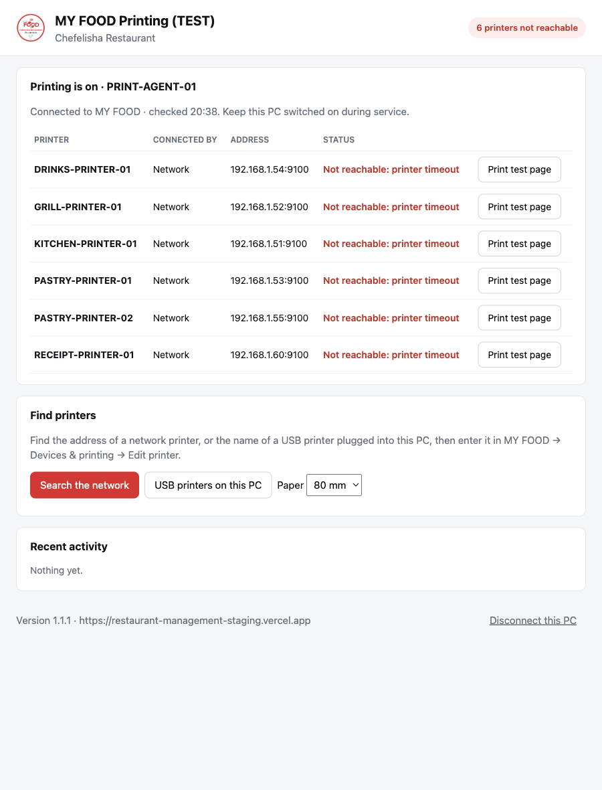

### 13.5 What the window shows

| Part | Meaning |
|---|---|
| Top-right status | **Printing is on**, **Not connected yet**, **No internet**, **Not connected**, or **N printers not reachable** |
| Printer table | Each printer MY FOOD gives this PC, how it is connected, its address, and **Ready** or **Not reachable: reason**. **Print test page** prints straight to it. |
| **Find printers** | **Search the network** lists network printers (about 10 seconds). **USB printers on this PC** lists printers installed in Windows; USB ones show "USB". **Copy** copies an address or name. |
| **Recent activity** | Printed / could not print, with times |
| **Disconnect this PC** | Unpairs this PC (printing stops until paired again) |

### 13.6 Restart, internet and printer problems

- **Restart the PC:** MY FOOD Printing starts by itself, still paired.
- **Closing the window** keeps it running in the tray. **Quit (printing stops)** in the tray menu stops it.
- **No internet:** jobs wait in MY FOOD and print when the connection returns.
- **Printer off or out of paper:** the job is retried automatically. After 3 failed attempts it moves to the station's **Backup** printer, if one is set. When the printer is back, waiting jobs print **once**. If a job may have been printed twice, it is marked *possible duplicate*.
- **Update:** MY FOOD Printing updates itself when restarted, when a new version is published.

---

## 14. Printer installation

### 14.1 For each printer

1. Put it where it is needed (kitchen pass, bar, counter).
2. Load paper (58 mm or 80 mm roll) and switch it on.
3. **Network printer:** connect it by cable to the router (or set up its Wi-Fi as its manual says). Print its self-test page (hold **FEED** while switching on) to see its IP address. **Tip:** ask the router admin to *reserve* that address so it never changes.
4. **USB printer:** plug it into the printing PC and install its Windows driver from the maker.
5. **Find it in MY FOOD Printing:** **Search the network** (or **USB printers on this PC**) → **Print test page** to confirm which is which.
6. **Add or edit it in MY FOOD** (Devices & printing):
   - **Name** (e.g. KITCHEN-PRINTER-01);
   - **How is it connected?**: *Network (cable or Wi-Fi, has an IP address)* or *USB cable into the printing PC*;
   - **Printer IP address** (e.g. `192.168.1.50`) or **Windows printer name** (exactly as listed);
   - **Paper width** 80 mm or 58 mm;
   - **Printed by**: PRINT-AGENT-01 (or the Hub);
   - **Backup printer (optional)**.

   Press **Save**.

   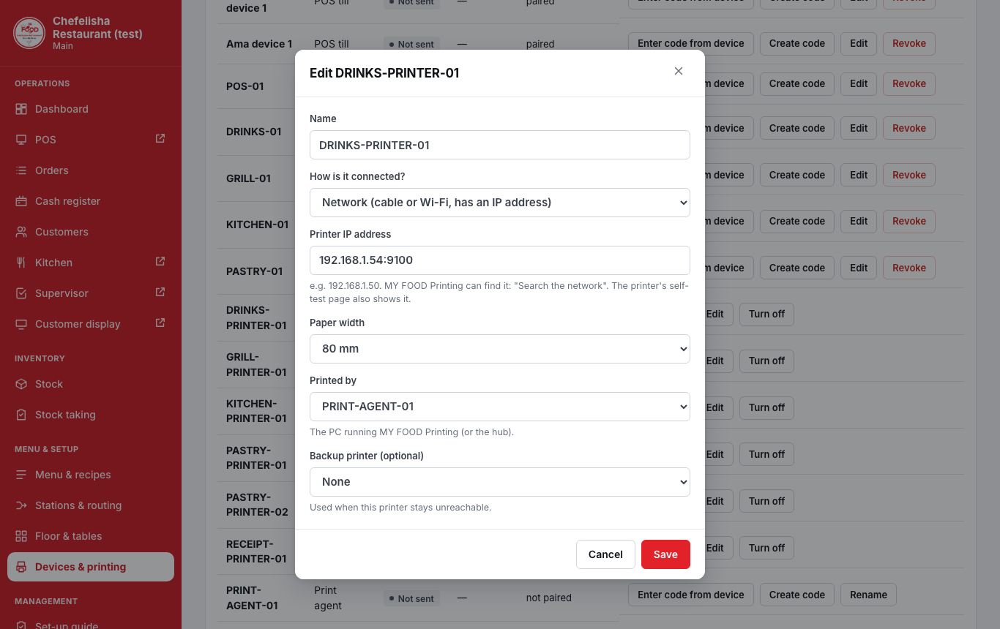

7. Press **Test print** on the printer's row. MY FOOD reports **printed**, **did not print** (with the reason) or **has not printed yet** (MY FOOD Printing is not running).

> ⚠ `192.168.0.1` and `192.168.1.1` are usually the **Wi-Fi router**, not a printer. MY FOOD warns about this.

### 14.2 Printer routing: which ticket prints where

```
Order sent → each item's product → its station (routing rules) → the station's screens and printers
Receipt / bill → the till's Receipt printer
```

- **Routing rules** (Stations & routing): an item goes to the station set for the **product**, else its **category**, else the **default** station.
- Each station can have any mix of screens and printers: **Connect screen or printer** with the role **Main**, **Extra copy** or **Backup (used if the main printer fails)**.

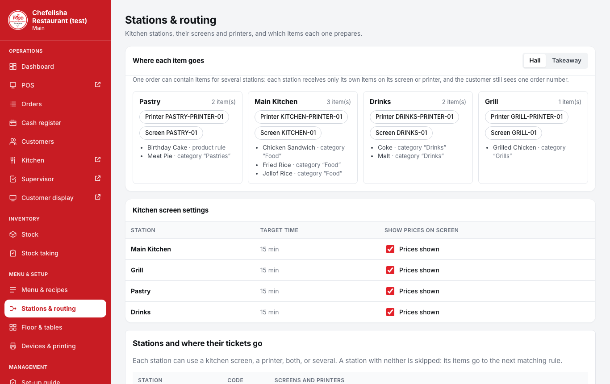

### 14.3 Turning a printer off

**Turn off** on its row. A turned-off printer receives no new tickets; a station with no other output is skipped. **Turn on** to use it again.

### 14.4 Print queue

Devices & printing → **Print jobs not yet printed** lists every job that did not print, with **Attempts** and **Last error**. Press retry to send one again.

### 14.5 Printer tests to do

- ☐ Test print from MY FOOD Printing (**Print test page**)
- ☐ **Test print** from Devices & printing reports "printed"
- ☐ Kitchen ticket printed for a test order (shows order number, items, *SENT BY: NAME - ROLE*)
- ☐ Receipt printed from the till (**Print receipt**)
- ☐ Bill printed (**Print bill**), showing *BILL - NOT PAID*
- ☐ Failure test: switch the printer off → send an order → the ticket waits → switch on → it prints **once**
- ☐ Backup test (if a backup printer is set): main printer off → the ticket prints on the backup after about 3 attempts

> **Not currently available:** opening a cash drawer from MY FOOD; sending one failed ticket to a different printer by hand.

---

## 15. Kitchen screen installation

### 15.1 Setup

1. Place a screen (TV with a small PC, or a tablet) where the cooks can see it. Make it touch-capable if possible.
2. Stations & routing: create the station (e.g. **Main Kitchen**, **Grill**, **Drinks**) and set **Target time**. Choose **Show prices on screen** or **Hidden**.
3. Devices & printing: add a **Kitchen screen** with its **Station (KDS)**; connect it to the station as **Main**.
4. On the screen, open **https://www.chefelisha.cc/pair** and pair it (section 9.1). It opens its station's board.

### 15.2 Using the kitchen screen

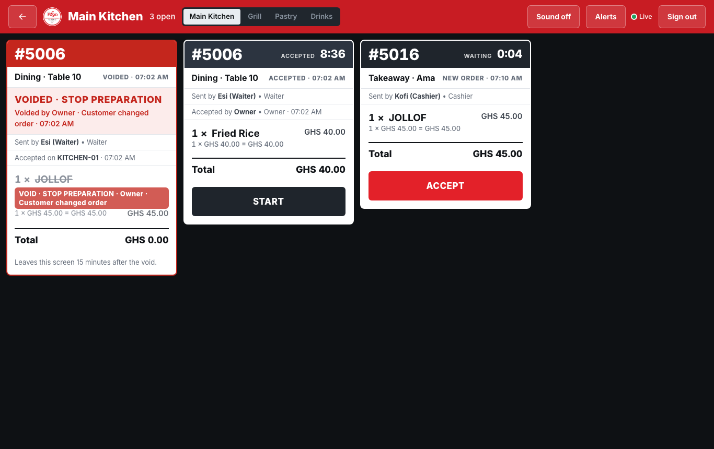

| On screen | Meaning / what to do |
|---|---|
| Ticket header | Order number and time waiting (turns late after the target time) |
| Where | Table (e.g. Hall · Table 12) or Takeaway · customer name |
| **Sent by** | Who sent the order and their role |
| Items | Quantity, kitchen name, options, notes; prices if **Show prices on screen** |
| **START** | Begin cooking |
| **PAUSE** / **RESUME** | Put a ticket on hold and continue it |
| **READY** | Food is ready: the supervisor, the till and the customer display see it at once |
| **RECALL** | Bring a ready ticket back |
| **BUMP** | Clear a ready ticket from the screen |
| Station tabs | Switch station (if the person may see several) |
| **Sound off** / **Alerts** | Sound and alert settings for new tickets |
| *Kitchen connection lost. Reconnecting…* | Internet or Hub problem; the screen refreshes every 20 s |

Voided items show as struck through (**Do not prepare**). With a kitchen printer, the same ticket also prints.

---

## 16. Customer display installation

1. Place a screen facing the waiting area.
2. Devices & printing: add a device of type **Customer display** (e.g. CUSTOMER-DISPLAY-01).
3. On the screen, open **https://www.chefelisha.cc/pair** and pair it (section 9.1). It shows the board.

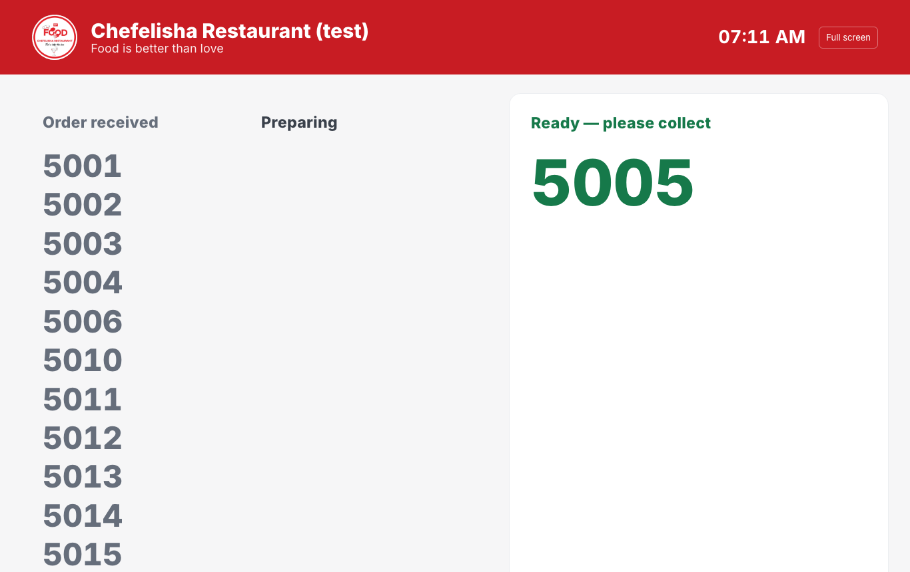

- Customers see order numbers under **Order received / Preparing** and **Ready — please collect**, with *Please collect your order when your number is under Ready*.
- Staff should not use this screen for anything else. It needs no sign-in and shows no prices or phone numbers.
- **Test:** send a test order and mark it READY on the kitchen screen. The number moves to **Ready**.
- **Restart:** it opens straight to the board.

---

## 17. Supervisor screen

Open **Supervisor** (Operations menu) on any signed-in device of someone with the kitchen or serving permission.

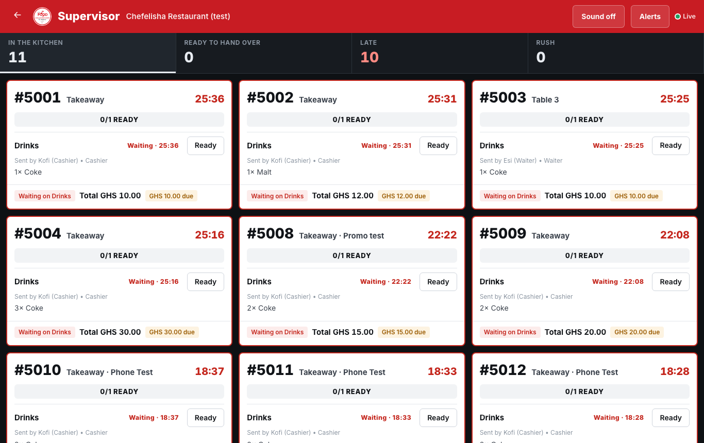

- Every order in the kitchen, with each station's status and **x/y READY**.
- Filters at the top, for example **In the kitchen**, **Ready to hand over**, **Late**.
- **Ready** per station (people with kitchen permission).
- Orders show **RUSH** when rushed, *Sent by* per station, and **Paid**.
- When food is handed over: **Served** / **Handed to customer**.
- **Handed over · last hour** lists recent hand-overs.

---

## 18. Device naming standard

MY FOOD already uses names like **POS-01**, **KITCHEN-01**, **DRINKS-01**, **CUSTOMER-DISPLAY-01**, **PRINT-AGENT-01**. Continue the same pattern (letters, numbers, dashes; 2–40 characters):

| Device | Name pattern | Examples |
|---|---|---|
| Till | `POS-NN` (+ place if helpful) | POS-01, POS-02 TERRACE |
| Kitchen screen | `<STATION>-NN` | KITCHEN-01, GRILL-01, DRINKS-01, PASTRY-01 |
| Customer display | `CUSTOMER-DISPLAY-NN` | CUSTOMER-DISPLAY-01 |
| Printing PC | `PRINT-AGENT-NN` | PRINT-AGENT-01 |
| Printer | `<USE>-PRINTER-NN` | KITCHEN-PRINTER-01, RECEIPT-PRINTER-01 |
| Hub | `HUB-NN` | HUB-01 |

Stick a label with the name on each physical device.

---

## 19. Device installation table

| Device | Location | Name | Purpose | Pairing method | Tested (initials) |
|---|---|---|---|---|---|
| Till | | POS-01 | Orders & payments | Code shown on device → its row | |
| Till | | POS-02 | Orders & payments | Code shown on device → its row | |
| Kitchen screen | | KITCHEN-01 | Main kitchen tickets | Code shown on device → its row | |
| Kitchen screen | | DRINKS-01 | Drinks tickets | Code shown on device → its row | |
| Customer display | | CUSTOMER-DISPLAY-01 | Ready board | Code shown on device → its row | |
| Printing PC | | PRINT-AGENT-01 | Runs MY FOOD Printing | Printing code → PRINT-AGENT-01 row | |
| Printer | | KITCHEN-PRINTER-01 | Kitchen tickets | Not paired (Edit printer) | |
| Printer | | RECEIPT-PRINTER-01 | Receipts & bills | Not paired (Edit printer) | |
| Hub PC (optional) | | HUB-01 | Offline operation | Hub code → HUB-01 row | |
| | | | | | |
| | | | | | |

---

## 20. Daily operations on the POS

### 20.1 Start of day

See the checklist in section 32. Then:

1. Staff sign in on their till with their PIN.
2. **Cashiers:** open the cash register (section 23). The POS shows **Open register** until it is open, then **Register open**.

### 20.2 Taking an order

1. Choose the area tab:
   - **Hall** (tables): tap a free table. The table states are **Available**, **Occupied**, **Ready to serve**, **Awaiting payment** and **Needs cleaning** (**Tap when clean**).
   - **Takeaway**: **+ New takeaway order**.
2. **Customer** (optional): on takeaway, type **Phone number** and **Customer name**. A known number shows the customer (**Use** fills the name).
3. Add products: tap them. Use **Search products** or the category buttons. Products with options open a window for them.
4. Adjust quantities with **−** / **+**. Add a **Note for the kitchen** if needed.
5. Check the lines and the total.
6. **Send to kitchen** (or **Save order, then take payment** in pay-before areas). The kitchen screens and printers get the ticket at once.
7. Add more items later: open the same order and send again. Only the new items go to the kitchen.

**Other buttons on an open order:**

| Button | What it does |
|---|---|
| **Rush** / **Remove rush** | Marks the order **RUSH** on the kitchen screens |
| **Customer** | Add or change the customer |
| **Move** | Move to another table, or to takeaway |
| **Merge** | Merge into another open order |
| **Discount** | Manager discount with a reason (Supervisor/Manager/Owner) |
| **Cancel / void…** | Cancel the whole order, void items already sent, or void a payment recorded by mistake (managers). Always with a reason, recorded in **Activity**. |
| **Served** / **Picked up** | Food handed over |
| **Print bill**, **Take payment**, **Print receipt** | Sections 22–24 |

On phones, the POS shows a bar at the bottom with the number of items, the total and **View order**.

### 20.3 Orders page

**Orders** lists every open order from every till, and today's and yesterday's completed ones. Open one to see:
- its items;
- **Order taken by**, **Sent to kitchen by** and **Payment taken by**;
- **Print receipt** / **Reprint receipt**, and **Refund** (managers).

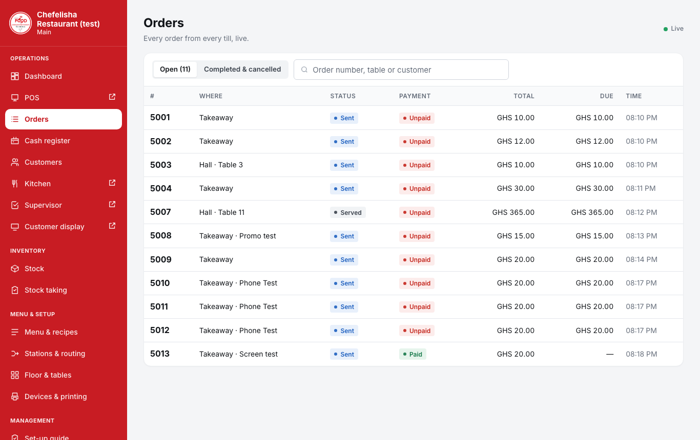

---

## 21. Customers

The telephone number is required. MY FOOD stores it in one form: `024 123 4567`, `0241234567` and `+233 24 123 4567` are the same customer.

| Task | How |
|---|---|
| Add during an order | Takeaway order → **Phone number** (+ **Customer name**). A new number becomes a new customer when the order is sent. |
| Add from the Customers page | **Customers** → **Add customer** → **Full name**, **Telephone number** (required), **Email (optional)**, **Notes (optional)** → **Save** |
| Duplicate number | MY FOOD says the customer already exists and offers to open them |
| Search | Customers → **Search by name or phone number** |
| History | Open a customer: **Orders**, **Total spend**, **First visit**, **Last visit**, **Order history** |
| Call | **Call** (opens the phone's dialler; nothing is sent automatically) |
| Correct details | Open the customer → **Edit** (managers) |
| Merge duplicates | Open the duplicate → **Merge duplicate…** → choose the customer to keep → **Reason** → **Merge**. Nothing is deleted. |

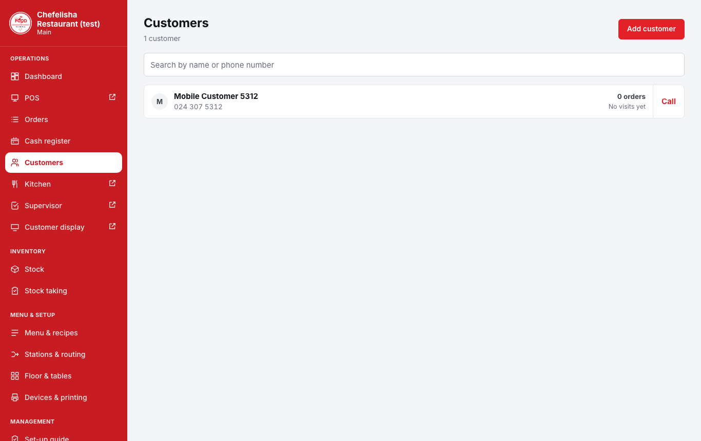

Who sees what:
- Tills can only look customers up and add them. A name search shows masked numbers (e.g. `024 *** 4567`).
- The customer list is for Owner, Manager and Supervisor.
- Phone numbers never appear on kitchen tickets or the customer display.

---

## 22. Bills

> **A bill is NOT a receipt. Printing a bill does NOT mean the customer has paid.**

1. The customer asks for the bill → open the order → **Print bill**. It prints on the till's receipt printer, headed **BILL - NOT PAID**. If the till has no printer, it is shown on screen.
2. The order shows **Bill printed · awaiting payment**. The POS **Bills** tab lists all unpaid bills (**Bills awaiting payment**). Search by order number, table or amount.

   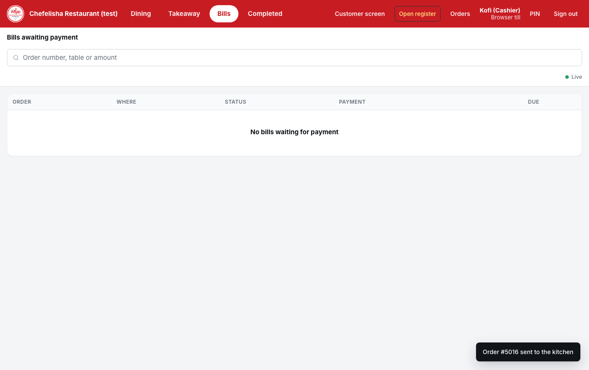

3. **Reprint bill** prints another copy marked **BILL / COPY**.
4. Take payment (section 24). The bill becomes paid and leaves the Bills tab.

A bill never creates a payment and never changes stock.

---

## 23. Cashier register

### 23.1 Opening

1. **Cash register** (Operations menu, or **Open register** on the POS).
2. Count the cash in the drawer. Type it in **Opening cash (GHS)** (optional **Note**).
3. Press **Open register with GHS …**. MY FOOD records the cashier, the terminal, the time and the opening cash.

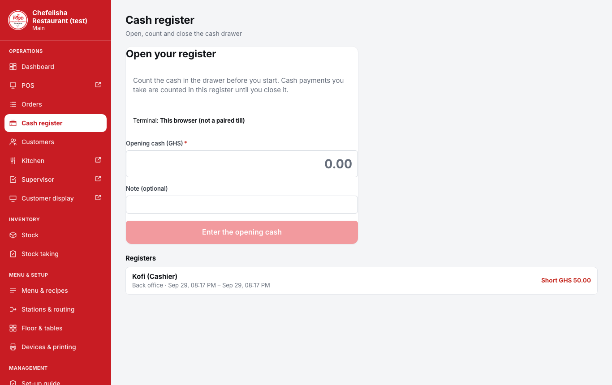

While open, the page shows **Expected cash in drawer** and cash sales, MoMo, card, total sales and orders. Every payment the cashier records goes into their register. A cash refund recorded by a manager on that till also comes out of that drawer.

### 23.2 Closing (end of shift)

1. **Close register** → **Count the cash**.
2. Count every note and coin. Type it in **Actual cash counted (GHS)**.
3. MY FOOD shows **Balanced**, **Short by GHS …** or **Over by GHS …**. Add a **Note** if there is a difference.
4. Press **Review**, check the figures, then **Close register**. A double tap closes it once.
5. The **Register closing report** opens: cashier, terminal, times, opening cash, cash sales, expected cash, actual cash, variance, MoMo, card, total, orders, dine-in/takeaway, discounts, tax, voids, and signature lines. Press **Export** → **PDF** to print it for signing.

**Expected cash** = opening cash + cash payments − cash refunds. **Variance** = actual − expected. MY FOOD records the variance as it is; it never changes the sales to match the cash.

A closed register cannot be changed. An Owner or Manager can **Reopen…** it with a reason. This is recorded, and the undone close is kept in **Activity**.

### 23.3 Sample end-of-shift procedure

1. Finish or hand over open orders; check the **Bills** tab.
2. **Close register**, count, **Review**, **Close register**.
3. Print the closing report (PDF), sign it with the manager, and put the cash away.

---

## 24. Payments

MY FOOD **records** payments. It does not connect to MoMo or card machines. The cashier confirms the money first, then records it.

1. Open the order → **Take payment**.
2. Choose the method:

| Method | What to do | What is recorded |
|---|---|---|
| **CASH** | Type **Cash received**. MY FOOD shows the **Change**. → **Complete payment** | Amount, cash received, change |
| **MOMO** | **Only after** the customer's MoMo payment shows as successful on the phone: optionally type the **MoMo transaction ID (from the customer's phone)** → **Complete payment** | Amount and the transaction ID you typed. **MY FOOD does not check MoMo itself.** |
| **CARD** | **Only after** the card machine approves: optionally type the **Card slip reference** → **Complete payment** | Amount and reference |
| **SPLIT** | Press **SPLIT**, then for each part choose the method, the **Amount for this payment** → **Record this payment**. Repeat until **Fully paid.** | Each part separately |

3. When fully paid, the order shows **Paid**; with the food handed over it becomes **Completed**.
4. **Print receipt** (a second print is marked **REPRINT**).

- **Wrong amount:** MY FOOD will not accept more than the balance due. Record the correct amount.
- **Payment recorded by mistake:** a manager uses **Cancel / void…** → **Void a payment recorded by mistake**, with a reason.
- **Money returned to the customer:** a manager uses **Orders** → open the order → **Refund**, with the amount and a reason.
- **Retrying:** pressing a payment button twice never records it twice.

---

## 25. Inventory and stock taking

### 25.1 Stock items and movements

Inventory → **Stock**:

| Task | Button | Who |
|---|---|---|
| Add an ingredient / item | **New stock item** (name, unit, minimum, cost) | Manage stock |
| Opening stock and deliveries | **Receive delivery** (stock starts at zero: record the opening quantity as a delivery) | Manage stock |
| Spoilt / wasted | **Record wastage** (with reason) | Manage stock |
| Correction | **Adjust stock** (with reason) | Manage stock |
| History | **Recent stock movements**: *Delivery*, *Wastage*, *Adjustment*, *Stock count*, *Sold*, *Returned (order cancelled)* | — |

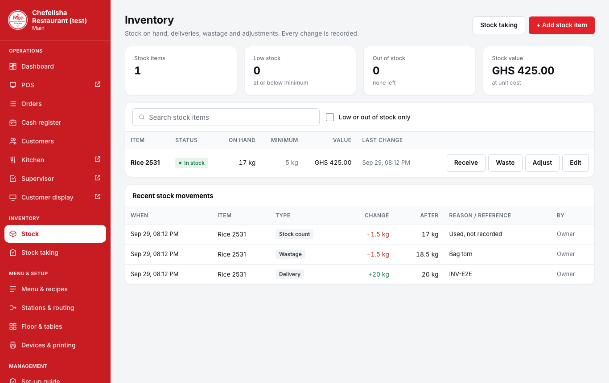

Stock goes down automatically when a product **with a recipe** (Menu & recipes → product → **Recipe**) is sent to the kitchen. It comes back when the whole order is cancelled. Items voided after they were sent do **not** return to stock (the kitchen may already have used the ingredients). Products without a recipe do not change stock. **Low stock** and **Out of stock** are shown on the Dashboard and here. The till also shows **Ingredient low** / **Ingredient out** (the product is still on sale).

### 25.2 Stock taking

Inventory → **Stock taking**:
1. **+ Start stock count** → MY FOOD lists every active item with its **System** quantity.
2. Count and type each **Counted** quantity. A **Variance** needs a **Reason** (*Required: wastage, usage, theft…*).
3. **Submit count for approval**.
4. A person with *Manage stock* checks it → **Approve and adjust stock**. Stock changes only now.

   **Cancel count** changes nothing.

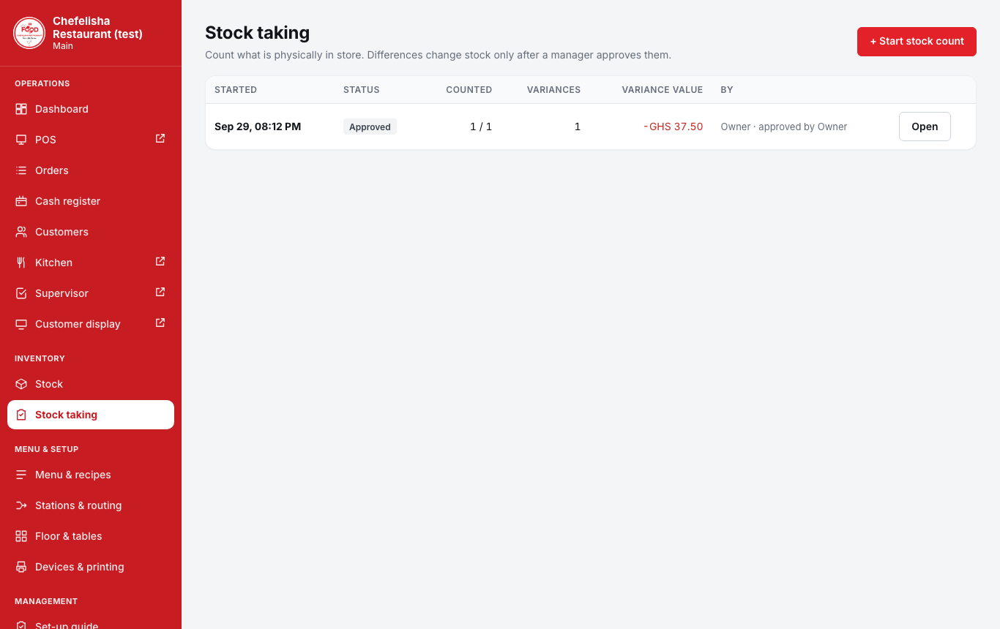

---

## 26. Promotions and discounts

### 26.1 Promotions (automatic)

Management → **Promotions** → **New promotion**:

- **Type**: **Percentage off**, **Amount off**, **Promotional price**, **Bundle price**, **Buy X get Y free**.
- **Applies to**: products, categories (including the categories inside them), or **Everything on the menu**.
- **When**:
  - days of the week;
  - time from/until (may pass midnight, e.g. 22:00 to 02:00);
  - **Starts on** / **Ends on (last day)** (leave empty to start now and never end).
- **Priority (0–100)**: when several promotions apply.
- **Preview**: *Exactly what the tills will charge. Nothing changes until you save.*
- Save with **Save and turn on** or **Save (paused)**. Later use **Pause** / **Turn on**.
- Statuses: **Running**, **Upcoming**, **Paused**, **Ended**.

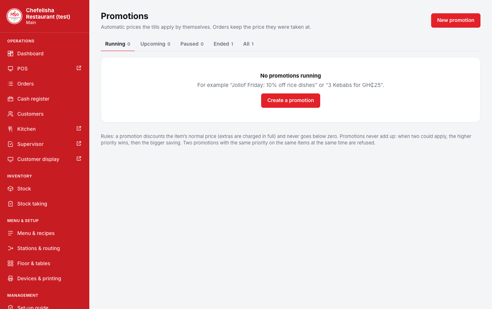

The promotion name and saving show on the till, on the receipt and on the kitchen screen. Reports show promotion discounts separately.

### 26.2 Manager discounts (one order)

Order → **Discount** → *Percentage off* or amount → **Reason** (e.g. *Regular customer, late food, staff meal*) → **Apply discount**. It is recorded in Activity. **Replace discount** changes it.

---

## 27. Reports

Management → **Reports**. Choose a report, a period (**Today**, **Yesterday**, **This week**, **This month**, **Custom**) and **Filters**. Every report uses the restaurant's business day (Africa/Accra time; orders before the cut-off time count for the previous day).

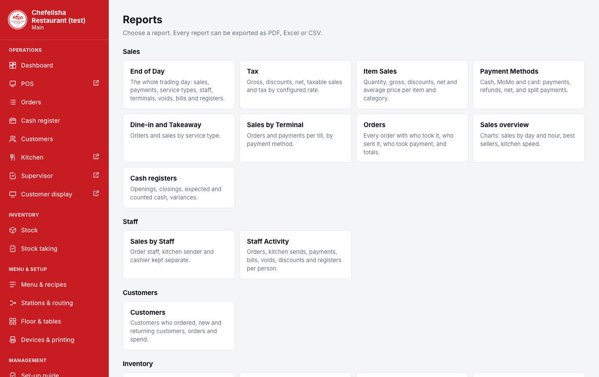

| Report | Shows | Useful filters |
|---|---|---|
| **End of Day** | Sales, payments by method, dine-in/takeaway, staff, terminals, tax, registers, stock movements, voids, bills, best sellers | service type, staff, terminal, payment method |
| **Tax** | Gross, discounts, net, taxable sales, tax by rate (included / added) | service type, category, item |
| **Item Sales** | Quantity, gross, promotions, discounts, net, average price, tax per item and category | service type, payment method, category, item, table, sort |
| **Payment Methods** | Cash, MoMo, card: payments, refunds, net, split payments | terminal, staff (cashier) |
| **Dine-in and Takeaway** | Orders and sales per service type | category, item |
| **Sales by Terminal** | Payments per till, by method | terminal, payment method |
| **Orders** | Every order with order staff, kitchen sender, cashier, totals | order status, service type, table, staff |
| **Sales by Staff** | Orders taken, sent to kitchen and payments taken per person (not a ranking) | staff |
| **Staff Activity** | Orders, sends, payments, bills, voids, cancellations, discounts, registers per person | staff |
| **Customers** | Customers on record, new, returning, orders, spend | service type |
| **Inventory Valuation** | Stock on hand now, at cost | — |
| **Stock Movements**, **Deliveries**, **Wastage**, **Adjustments** | Every stock change, with before/after, who, why | movement type, staff |
| **Stock Taking** | Expected, counted, variance | — |
| **Recipe Consumption** | Ingredients used by sales and their cost | service type |
| **Sales overview** | Charts: sales by day and hour, best sellers, kitchen speed | date range |
| **Cash registers** | Opens the Cash register page (closings and variances) | — |

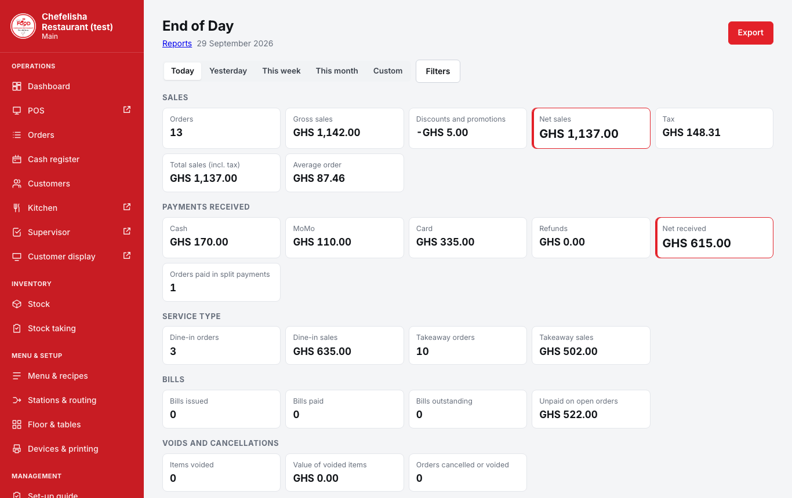

What the main numbers mean:
- **Gross sales** = prices × quantities.
- **Net sales** = gross − promotions − manager discounts.
- **Total sales (incl. tax)** = net + tax added on top.
- **Received** = payments − refunds (voided payments never count).
- The tax report is a restaurant summary, **not an official tax return**.

Reports need the *Dashboard & reports* permission. The Customers report also needs *Customers list & history*.

The **Dashboard** shows today at a glance. **Activity** shows everything that was done, by whom and why, and can be exported with **Export CSV**.

---

## 28. Exports (PDF, Excel, CSV)

On any report (and on a register closing report), press **Export** and choose:

| Format | Use it to | Notes |
|---|---|---|
| **PDF** | Print or file the report | MY FOOD header on every page, period, filters, page numbers, totals. Amounts in GHS. |
| **Excel** (.xlsx) | Work with the figures | A Summary sheet plus one sheet per table, with filters, frozen headings and totals |
| **CSV** | Load into other programs | Plain data |

- The file downloads with a name like `myfood-end-of-day-2026-09-28.pdf`. On a phone it goes to Downloads / Files.
- Exports contain exactly what is on screen: the same period and filters.
- Every export is recorded in Activity: who, which report, which format.

---

## 29. Phones and tablets (mobile app)

MY FOOD on a phone is the **same website**, laid out as an app. It is not a separate Android or iPhone app.

- **Open:** go to www.chefelisha.cc in Chrome (Android) or Safari (iPhone).
- **Install:** Chrome menu → **Install app** / **Add to Home screen**; Safari → Share → **Add to Home Screen**. It then opens full screen from its icon.
- **Sign in:** owners/managers with email + PIN the first time, then the PIN only.
- **Navigation:** the tab bar at the bottom (e.g. **Home**, **POS**, **Orders**, **Register**) and **More** for everything else, including **Change PIN** and **Sign out**.

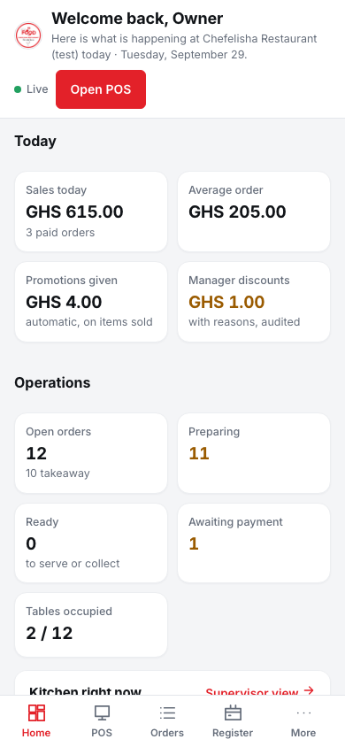 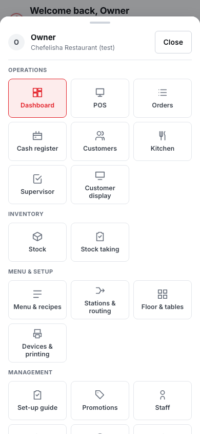

- **POS on a phone:** two columns of products, and a bar with the number of items, the total and **View order**. The order opens full screen.
- **Reports, customers and the register** work on the phone. Filters and **Export** open from the bottom of the screen.

> Mobile was tested in Chrome's phone simulation at common phone sizes; check once on the restaurant's actual phones.

---

## 30. Offline operation

See section 3 for what happens in each case.

**Online mode.** Taking orders needs internet. When it drops:
- the till keeps the order and offers **Retry send**;
- nothing is sent twice;
- MY FOOD Printing jobs wait and print later.

**Hub mode.** The restaurant keeps working. The Hub sends orders, payments, kitchen tickets, stock movements and records of actions to the cloud when the internet returns.
- Each record is sent once; re-sending never duplicates.
- A price changed in the back office while offline does not change orders already taken.
- A staff member deactivated in the back office cannot sign in on the Hub after its next sync.

**If the Hub shows *Needs attention*:** do not delete anything. Write down what it says and call MY FOOD support.

**Payments offline (Hub mode):**
- cash is recorded normally;
- record MoMo and card only after the customer's phone or card machine confirms them;
- they reach the cloud when the internet returns.

---

## 31. End-of-day checklist (print)

- ☐ All orders finished: nothing left in **Orders → Open** (or handed to the next shift)
- ☐ **Bills** tab empty, or each unpaid bill explained
- ☐ All payments recorded (check MoMo transaction IDs on the phone)
- ☐ Each cashier: **Close register** → count → **Review** → **Close register**
- ☐ Variance checked; closing report printed (PDF) and signed
- ☐ **Reports → End of Day** reviewed (and exported if the owner wants it)
- ☐ Stock: record wastage; check **Low stock** on the Dashboard
- ☐ Staff press **Lock** on the tills
- ☐ **Leave running:** the MY FOOD Printing PC (or Hub PC) and the router, if printing or the Hub is needed early

---

## 32. Start-of-day checklist (print)

- ☐ Internet / router lights normal
- ☐ Hub PC on, Hub window **Connected** / **All sent** *(Hub mode only)*
- ☐ Printing PC on, MY FOOD Printing shows **Printing is on** *(online mode)*
- ☐ Printers on, paper loaded (Devices & printing panel says **Printing is on**)
- ☐ POS-01 PIN pad showing ☐ POS-02 PIN pad showing
- ☐ Kitchen screens showing their station (green **Live**)
- ☐ Customer display showing the board
- ☐ Cashiers: **Open register** with the counted float
- ☐ Test order: kitchen screen ✓ kitchen ticket printed ✓ receipt printed ✓ (then cancel it: **Cancel / void…** → **Cancel the whole order**)

---

## 33. Troubleshooting

### Pairing

| Problem | Possible cause | What to do |
|---|---|---|
| *That pairing code is not valid.* | Mistyped, or not a pairing code | Check the code on the device; type it again |
| *That pairing code has expired.* | More than 10 minutes passed | The device already shows a new code: type that one |
| *That pairing code has already been used for another device.* | The code paired something already | If this device still needs pairing, use the code it shows now |
| *The device has shown a newer code since.* | **Show a new code** was pressed | Use the code on its screen now |
| *That is a code created here in MY FOOD ("Create code")…* | A Create code code typed in **Enter code from device** | Type it **on the device**: **I have a code from a manager** |
| *This code comes from MY FOOD Printing / MY FOOD Hub…* | Printing/Hub code entered on a till's row | Enter it on the **print agent** / **Hub** row. Nothing was changed. |
| *This device is deactivated or belongs to another restaurant.* | Wrong row or deactivated record | Choose the right row |
| A till was signed out and asks to pair again | It was paired again elsewhere, or **Revoked** | Pair it once more on its own row |
| Code on screen changed | It expired (10 min), or **Show a new code** was pressed | Use the new code |
| Device asks to pair after refresh/restart | Browser data was cleared, or it was revoked | Pair it once more |
| *No connection to MY FOOD right now. This code still works; waiting…* | Internet blip | Wait; the code still works |

### Printing

| Problem | Possible cause | What to do |
|---|---|---|
| Panel: *Printing is not running yet* | MY FOOD Printing not installed/paired | Section 13 |
| Panel: *Printing has stopped* | Printing PC off, asleep or without internet, or app quit | Switch on the PC; check the tray icon; check internet |
| *Test page … has not printed yet* | Same as above | Same as above |
| *did not print: printer timeout* / *Not reachable* | Printer off, cable, wrong address, out of paper | Check power, paper and cable; **Search the network** in MY FOOD Printing; fix the address with **Edit** |
| Address warning *usually the Wi-Fi router* | Router address entered | Find the printer's real address |
| USB: *no Windows printer with this name* | Name differs | Copy the name from **USB printers on this PC** |
| Prints at the wrong place | Routing | Stations & routing: check the product/category rule and the station's outputs |
| Receipt shown on screen instead of printing | The till has no **Receipt printer** | Edit the till → Receipt printer |
| Ticket marked *possible duplicate* | A print may have happened before a failure | Check with the kitchen; nothing else to do |

### POS

| Problem | Possible cause | What to do |
|---|---|---|
| *PIN not recognised* | Wrong PIN | Try again; after 5 wrong tries wait 10 minutes; a manager can **Reset PIN** |
| *Too many wrong PINs…* | Lockout | Wait 10 minutes or ask a manager |
| Product greyed / **Sold out** | Marked sold out | Menu & recipes → **Back on sale** |
| *No connection to the server. Your action will be retried.* | Internet | **Retry send** when back |
| Kitchen did not get the order | Routing, screen offline | Check the kitchen screen is **Live**; check Stations & routing |
| *Enter the customer name* | The area requires a name | Type **Customer name** |
| *Table … already has an open order* | Table in use | Open the existing order or **Merge** |
| Payment refused (more than due) | Amount too high | Enter the balance due |

### Hub

| Problem | Possible cause | What to do |
|---|---|---|
| Tills cannot reach the Hub address | Hub PC off, different network, address changed | Switch on the Hub; same network; check the address in the Hub window |
| **Needs attention** | A record the cloud refused | Do not delete; call MY FOOD support |
| Changes waiting for a long time | No internet | Nothing to do; they are sent when it returns |
| Hub PC broken during service | — | If the internet works: back office → Hub row → **Stop running branch**; use www.chefelisha.cc |

### Kitchen and customer display

| Problem | Possible cause | What to do |
|---|---|---|
| No tickets | Wrong station, not paired, routing | Check the station tab; **Edit** the screen's station; check routing |
| *Kitchen connection lost. Reconnecting…* | Internet/Hub | Wait (refreshes every 20 s); check network |
| Late tickets | Target time passed | Normal warning; adjust **Target time** in Stations & routing |
| Customer display not updating | Network | Check network; reload the page |

---

## 34. If pairing goes wrong — do not keep generating codes

1. **Stop.** Do not press **Create code** or **Show a new code** again.
2. **Which device** are you pairing? Read its name label.
3. **Which row** will you use? It must be **that device's** row. For MY FOOD Printing, the **print agent** row; for the Hub, the **MY FOOD Hub** row.
4. **Where did the code come from?**
   - **Shown on the device's screen** → **Enter code from device** on its row.
   - **Made with Create code** → type it **on the device** (**I have a code from a manager**).
5. **Is the code still on the device screen?** Then it still works. Use it.
6. Type it and press **Pair device**. **Read the message** if it is refused: it says exactly why (section 33).
7. **Wait up to 10 seconds** for the device to continue.
8. Only if the code **expired** (or the message says so), use the new code the device shows.
9. **Still not working after two correct attempts?** Note the device name, the row used and the exact message, then call MY FOOD support (section 39).

---

## 35. Replacing a device

1. Devices & printing → the old device's row → **Revoke** (confirm). The old device stops working at once.
2. Prepare the new device (sections 11, 13, 15 or 16).
3. Pair the new device on the **same row** (the name stays, e.g. POS-02).
4. Test it (same tests as for installation).
5. Check the old device now shows the pairing screen or is refused.
6. Update the device register (section 38).

- **Printer:** **Edit** the printer with the new address (or add a new printer and connect it to the stations), then **Test print**. Old printer: **Turn off**.
- **Printing PC:** install MY FOOD Printing on the new PC and pair it on **PRINT-AGENT-01**. The old PC's pairing stops working. On the old PC use **Disconnect this PC**, or uninstall.
- **Hub PC:** install the Hub on the new PC and pair it on the Hub row. Call MY FOOD support before replacing a Hub that is running the branch.

---

## 36. Security

For everyone:
- Never tell anyone your PIN. Never write it on or near a till.
- Press **Lock** when you leave a till.
- Never photograph or send pairing codes. Never reuse them.
- Never approve a device you do not recognise.
- Report a lost or stolen phone, tablet or PC to a manager at once; the manager presses **Revoke**.

For owners and managers:
- Use your own phone or laptop for staff, devices and settings.
- **Deactivate** staff who leave, the same day.
- Remove (**Revoke**) old devices.
- Check **Activity** for unusual voids, refunds, discounts or register reopens.
- Never forward an owner verification or PIN-reset link.

---

## 37. Installer handover checklist

### System

- ☐ www.chefelisha.cc opens on every device
- ☐ Owner signs in (own device: PIN; new device: email + PIN)
- ☐ Each staff member signed in once and chose their own PIN
- ☐ POS: order taken and sent
- ☐ Kitchen screens receive tickets (with *Sent by*)
- ☐ Customer display shows Preparing / Ready
- ☐ MY FOOD Printing shows **Printing is on** *(online mode)*
- ☐ Hub **Connected**, **All sent**, branch running from the Hub *(Hub mode only)*
- ☐ Printers print (Test print reports "printed")
- ☐ Bill printed (**BILL - NOT PAID**) and paid
- ☐ Cash, MoMo (with ID) and card payments recorded
- ☐ Register opened, closed, closing report exported
- ☐ Customer added with phone; found by search
- ☐ Stock: delivery recorded; recipe product sold; stock went down
- ☐ Reports: End of Day shows the test orders; PDF/Excel/CSV downloaded

### Pairing

- ☐ All tills paired (on their own rows)
- ☐ Printing PC paired on PRINT-AGENT-01
- ☐ Hub paired *(Hub mode)*
- ☐ Kitchen screens paired, each on its station
- ☐ Customer display paired
- ☐ Every device has a name label matching MY FOOD
- ☐ Every device restarted once and is still paired

### Testing

- ☐ Test order created ☐ kitchen screen ticket ☐ kitchen printer ticket
- ☐ Customer display updated ☐ payment recorded ☐ receipt printed
- ☐ Order completed ☐ stock deduction verified ☐ report verified
- ☐ Test orders cancelled/voided and explained to the owner

Installer name: ______________________ Signature: ____________ Date: ________

Restaurant representative: ______________________ Signature: ____________ Date: ________

---

## 38. Installer device register

(A spreadsheet version is provided: **MY-FOOD-Device-Register.xlsx**. Never write passwords, PINs or codes in it.)

| Device name | Type | Location | Network / IP address | Paired (date) | Tested after restart | Installer initials |
|---|---|---|---|---|---|---|
| | | | | | | |
| | | | | | | |
| | | | | | | |
| | | | | | | |
| | | | | | | |
| | | | | | | |
| | | | | | | |
| | | | | | | |

---

## 39. Contacts and escalation

| Role | Name | Phone | Email |
|---|---|---|---|
| Restaurant owner | | | |
| Restaurant manager | | | |
| Installer / installation company | | | |
| MY FOOD support | | | |
| IT / network support | | | |
| Internet provider | | | |

**When to call MY FOOD support:**
- pairing still fails after section 34;
- the Hub shows **Needs attention**;
- printing does not work after section 33;
- anything shows an error you do not understand.

Have ready: the device name, what you were doing, and the exact message on screen (a photo of the screen is fine, as long as it shows no PIN).

---

## 40. Quick Reference Card

*(Also provided as a separate one-page file: MY-FOOD-Quick-Reference.pdf.)*

| Task | Steps |
|---|---|
| **Start of day** | Router on → Printing PC (or Hub) on → printers on → tills: PIN → cashier: **Open register** |
| **Take an order** | Area tab → table / **+ New takeaway order** → tap products → **Send to kitchen** |
| **Send more items** | Open the order → add → **Send to kitchen** |
| **Take payment** | **Take payment** → CASH (type cash received) / MOMO (after the phone confirms) / CARD (after the machine approves) → **Complete payment** |
| **Receipt** | **Print receipt** |
| **Bill** | **Print bill** (NOT paid!) → later **Take payment** |
| **Close register** | **Close register** → count → **Review** → **Close register** → Export PDF |
| **Pair a device** | Device: www.chefelisha.cc/pair shows a code → manager: Devices & printing → **that device's row** → **Enter code from device** → code → **Pair device** |
| **Restart a device** | Just restart. It stays paired. |
| **Internet down** | Online mode: **Retry send** when back. Hub mode: keep working. |
| **Printer problem** | Paper? Power? Cable? → MY FOOD Printing window shows **Ready** / **Not reachable** → Devices & printing panel |
| **Pairing problem** | **Stop.** Right device? Right row? Code from the device → Enter code from device. Code from Create code → type ON the device. Read the message. |

---

## 41. Screenshots: included and still required

**Included** (captured from the MY FOOD test system on 29 September 2026, in `images/`):

- `01-sign-in`, `02-pair-this-device`, `03-devices-and-printing`, `04-enter-code-from-device`, `05-till-pin-pad`
- `06-create-code`, `07-edit-printer`, `08-dashboard`, `09-stations-and-routing`, `10-floor-and-tables`
- `11-menu`, `12-staff`, `13-settings`, `14-inventory`, `15-stock-taking`, `16-promotions`, `17-customers`
- `18-reports`, `19-end-of-day-report`, `20-orders`, `21-cash-register`, `22-activity`, `23-set-up-guide`
- `24-roles-and-permissions`, `25-pos-home`, `26-pos-order`, `27-payment`, `28-pos-bills`
- `29-kitchen-screen`, `30-supervisor`, `31-customer-display`, `32-phone-home`, `33-phone-more`
- `34-my-food-printing`

**Still required** (need the real Windows PCs or hardware):

- SCREENSHOT REQUIRED: **MY FOOD Hub window**, *Connect this hub to MY FOOD* (with code) and *Connected / All sent*
- SCREENSHOT REQUIRED: **MY FOOD Printing**, *Connect this PC to MY FOOD* (pairing code state)
- SCREENSHOT REQUIRED: **Windows installer** warning (*More info → Run anyway*) for Hub and Printing
- SCREENSHOT REQUIRED: **Printed kitchen ticket**, **receipt** and **BILL - NOT PAID** (photos of real paper)
- SCREENSHOT REQUIRED: **Dual-screen customer screen** on the real second monitor
- SCREENSHOT REQUIRED: **Register closing** dialog (*Count the cash* with Short/Over) on a real till

---

## 42. What MY FOOD does NOT do today

| Feature | Status |
|---|---|
| Automatic MoMo or card verification / payment terminals | **NOT CURRENTLY AVAILABLE**: payments are recorded by the cashier after confirming |
| Opening a cash drawer | **NOT CURRENTLY AVAILABLE** |
| Sending a failed ticket to another printer by hand | **NOT CURRENTLY AVAILABLE** (automatic retry and backup printer are available) |
| Editing roles / custom permissions in the screens | **NOT CURRENTLY AVAILABLE** |
| Deleting staff (history) | **NOT CURRENTLY AVAILABLE**: deactivate instead |
| SMS to customers, loyalty points | **NOT CURRENTLY AVAILABLE** |
| Delivery apps (e.g. Bolt Food, Glovo) | **NOT CURRENTLY AVAILABLE** |
| Accounting software export (beyond Excel/CSV) | **NOT CURRENTLY AVAILABLE** |
| Official tax filing format | **NOT CURRENTLY AVAILABLE**: the tax report is a summary |
| Native Android / iPhone app | **NOT CURRENTLY AVAILABLE**: MY FOOD is installed from the browser (section 29) |
| Code-signed Windows installers | **NOT CURRENTLY AVAILABLE**: Windows shows a warning (*More info → Run anyway*) |
| Reliable email to restaurant addresses | **Pending**: until connected, links are given by MY FOOD support |
| **Hardware verification** | **Physical hardware was not available for verification**: the Hub, MY FOOD Printing on Windows, USB and network printers, the dual-screen till and the kitchen/customer screens have been verified in software and test environments only. Complete the on-site tests in sections 11–16 and 37. |
